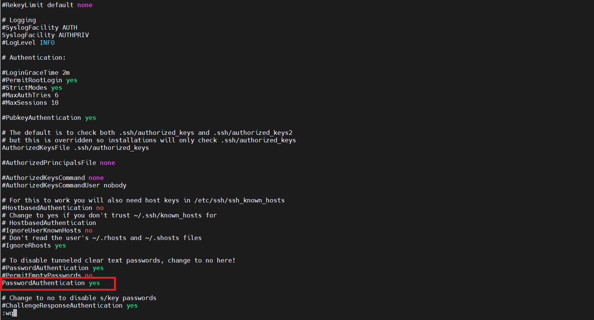

## Exercise-1 : Setup CentOs as node to ACS.
* Create a devops user , set password & provide sudo access .

```
sudo su - 
adduser devops
passwd devops
visudo 

## do changes as per below image 

Esc:wq 

```

 
 

* Install Python 

```
yum update -y
yum install -y python3
```

* PasswordAuthentication enable :
```
vi /etc/ssh/sshd_config 
# Do changes as shown in below image 
Esc:wq

systemctl restart sshd.service
systemctl status sshd.service

```
 
 
 


### On  ACS server :
* Copy the keys and check connection 
```
sudo su - devops 
ssh-copy-id dvops@<CentOsPublicIpaddress>
```


 


### Playbook for manual steps :

```
---
- hosts: all
  become: yes
  tasks:
    - name: installing httpd
      yum:
        name: httpd
        state: present
        update_cache: yes
    - name: enable httpd
      service:
        name: httpd
        enabled: yes
        state: restarted
    - name: installing php modules
      yum:
        name: "{{ item }}"
        state: present  
        update_cache: yes
      loop:
        - php
    - name: creating the file info.php
      file:
        path: /var/www/html/info.php
        state: touch

    - name: add content to the info.php file
      blockinfile:
        path: /var/www/html/info.php
        block: |
          <?php
          phpinfo();
          ?>
    - name: restart the apache
      service:
         name: httpd
         state: restarted
```

