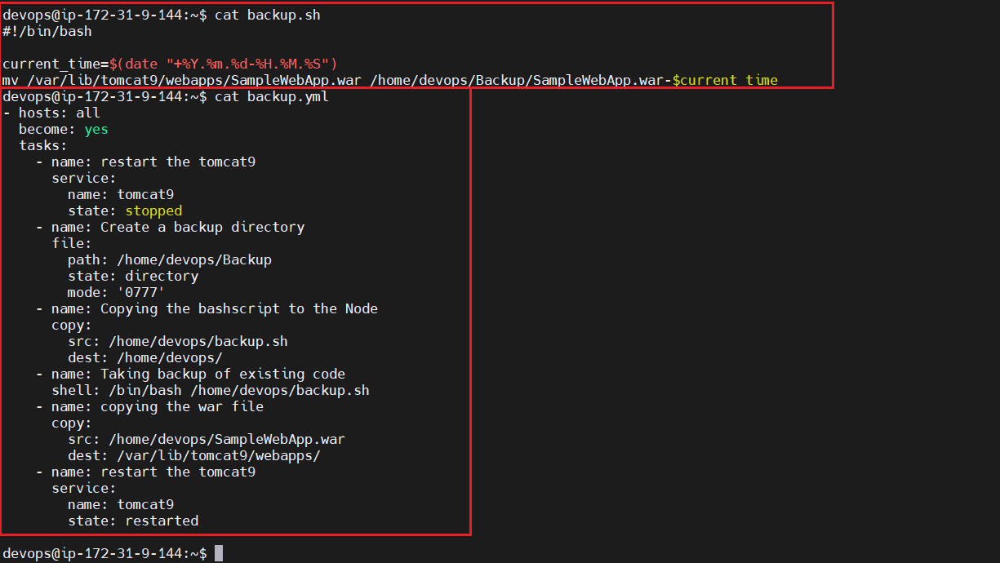

## Exercise-1 :  Write a playbook for above manual steps and setup CentOs as a node to ACS.
 
### Setup CentOs as node to ACS.

* Create a devops user , set password & provide sudo access .

```
sudo su - 
adduser devops
passwd devops
visudo 

## do changes as per below image 

Esc:wq 

```

 
 

* Install Python 

```
yum update -y
yum install -y python3
```

* PasswordAuthentication enable :
```
vi /etc/ssh/sshd_config 
# Do changes as shown in below image 
Esc:wq

systemctl restart sshd.service
systemctl status sshd.service

```
 
 
 


### On  ACS server :
* Copy the keys and check connection 
```
sudo su - devops 
ssh-copy-id dvops@<CentOsPublicIpaddress>
```


 


### Playbook for manual steps :

```
---
- hosts: all
  become: yes
  tasks:
    - name: installing httpd
      yum:
        name: httpd
        state: present
        update_cache: yes
    - name: enable httpd
      service:
        name: httpd
        enabled: yes
        state: restarted
    - name: installing php modules
      yum:
        name: "{{ item }}"
        state: present  
        update_cache: yes
      loop:
        - php
    - name: creating the file info.php
      file:
        path: /var/www/html/info.php
        state: touch

    - name: add content to the info.php file
      blockinfile:
        path: /var/www/html/info.php
        block: |
          <?php
          phpinfo();
          ?>
    - name: restart the apache
      service:
         name: httpd
         state: restarted
```


## Exercise-2: 

1. Run the playbook with below tasks :
   * Install java 
   * Install tomcat9
   * Stop the tomcat9
   * Copy the sample war to the /var/lib/tomcat9/webapps/
   * Restart the tomcat9
2. When you are running the above playbook for the second time change the playbook as per below tasks:
   * Stop the tomcat9
   * Take the backup of the exising code which is in /var/lib/tomcat9/webapps/
   * Copy the sample war to the /var/lib/tomcat9/webapps/
   * Restart the tomcat9

### Playbook for step-1 :

```
---
- hosts: all
  become: yes 
  tasks: 
    - name: installing java 
      apt:
        name: openjdk-11-jdk
        state: present
        update_cache: yes
    - name: installing tomcat9
      apt:
        name: tomcat9
        state: present 
        update_cache: yes
    - name: copying the war file
      copy:
        src: /home/devops/SampleWebApp.war
        dest: /var/lib/tomcat9/webapps/
    - name: restart the tomcat9
      service:
        name: tomcat9
        state: restarted
```


### Playbook for step-2 :

```

- hosts: all
  become: yes 
  tasks: 
    - name: Stop  the tomcat9
      service:
        name: tomcat9
        state: stopped 
    - name: Create a backup directory 
      file:
        path: /home/devops/Backup
        state: directory
        mode: '0777'
    - name: Copying the bashscript to the Node
      copy: 
        src: /home/devops/backup.sh
        dest: /home/devops/
    - name: Taking backup of existing code
      shell: /bin/bash /home/devops/backup.sh
    - name: copying the war file
      copy:
        src: /home/devops/SampleWebApp.war
        dest: /var/lib/tomcat9/webapps/
    - name: restart the tomcat9
      service:
        name: tomcat9
        state: restarted 


```

* Create a file named backup.sh on ACS server .

```
vi /home/devops/backup.sh

Add below content 
```
#!/bin/bash

current_time=$(date "+%Y.%m.%d-%H.%M.%S")
mv /var/lib/tomcat9/webapps/SampleWebApp.war /home/devops/Backup/SampleWebApp.war-$current_time

```

Esc:wq

```



