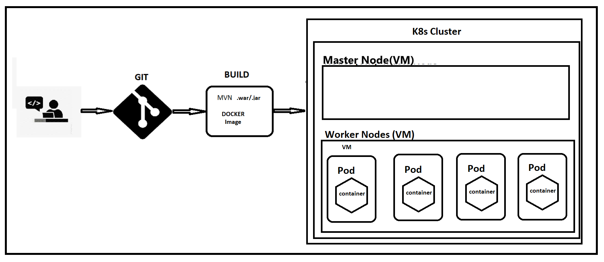
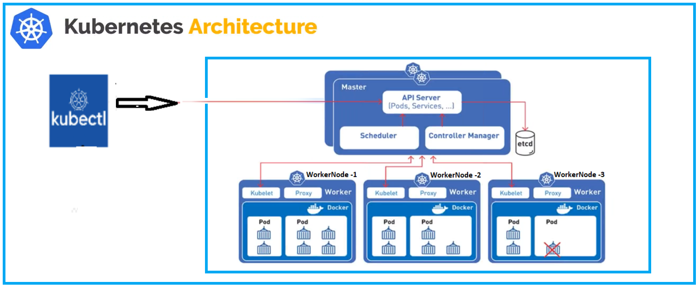
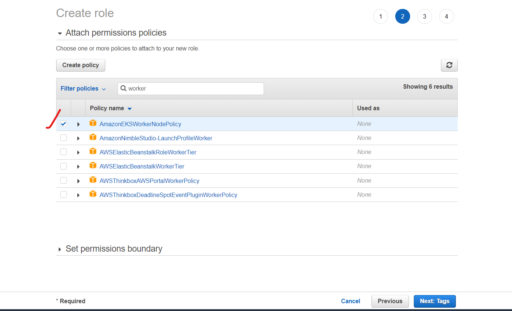
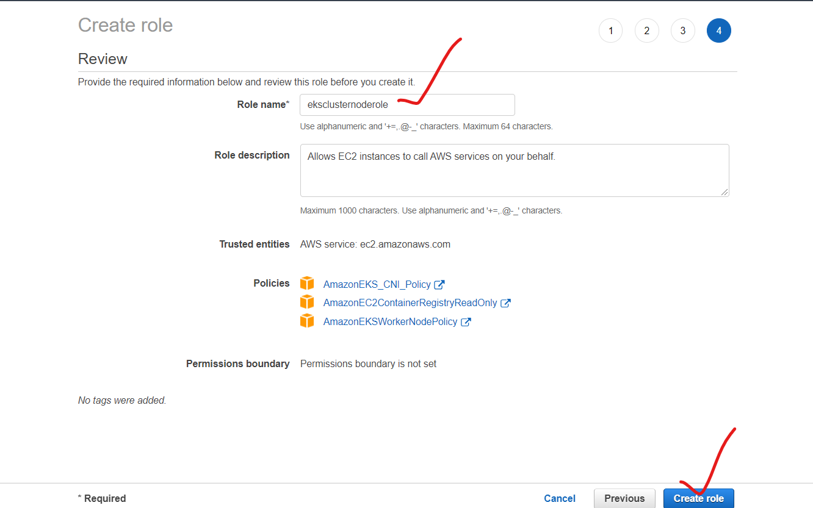
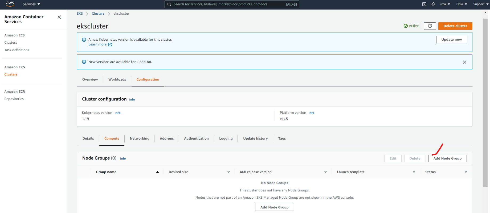
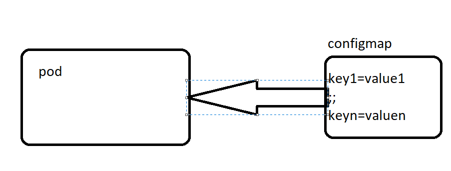

# Kubernetes or K8s :
* Kubernetes (often abbreviated as "K8s") is an open-source container orchestration platform. It provides a way to automate the deployment, scaling, and management of containerized applications. With Kubernetes, you can easily manage complex containerized applications that run across multiple cloud providers or on-premises infrastructure. 

* For the document [REFER HERE ](https://kubernetes.io/docs/concepts/overview/what-is-kubernetes/)

<br/>
<br/>

* * * 

<br/>
<br/>

## Integrate k8s in BasicDevopsPipeline:



<br/>
<br/>

* * * 

<br/>
<br/>


## Why you need Kubernetes and what it can do :
* Automatic scaling .
* Microservices .
* Handle persistent volume .(stateful vs stateless)
* Zero downtime deployments .
* Efficient loadbalancers integrations.
* Monitoring interface

<br/>
<br/>

* * * 

<br/>
<br/>

## Basic architecture of k8s:



# Kubernetes componenets:
* K8s cluster is combination of nodes.
* Nodes are of two types in K8S:
  1. Master node
  2. Worker Node

## Master is referred as the controlplane component:
* Control-plane-Components on master :

1. Kube-apiserver: 
    * The communicaion in the cluster from master to worker-nodes happens from the kube-apiserver.
2. etcd:
    * It is having all the information about the pods and nodes created and destroyed in your cluster.
    * It stores the information in the form of keyvalue pairs.
3. kube-scheduler:
    * It is responsible for scheduling your pods on the nodes.   
4. controller-manager:
    * It takes care of your desired state to be there on the nodes.

## Node components:
1. kubelet:
    * It's like an agent running on your all Worker nodes and tajes care of desired state.
2. Kube-proxy: 
    * It helps us to have a communication between the two pods , which are on the differen nodes.
 

<br/>
<br/>
<br/>
<br/>

* * * 

<br/>
<br/>
<br/>
<br/>

## Many ways to setup k8s cluster.
1. Kubeadm
2. EKS (Elastic kubernetes service)
2. AKS (AZURE kubernetes service)

## Setup kubernetes cluster by using kubeadm:
1. Take 3 VM's from AWS , having atleat 2 GB RAM
2. Install docker on all the nodes [REFER HERE](https://kubernetes.io/docs/setup/production-environment/container-runtimes/)
3. Installing using kubeadm, run the steps in the document on allnodes [REFER HERE](https://kubernetes.io/docs/setup/production-environment/tools/kubeadm/install-kubeadm/)


## Create a k8s cluster with kubeadm :

## Installing kubernets by using kubeadm:
1. Take 3 VM's from AWS , having atleat 2 GB 
2. Install docker on all the nodes [REFER HERE](https://kubernetes.io/docs/setup/production-environment/container-runtimes/)
3. Installing using kubeadm, run the steps in the document on allnodes [REFER HERE](https://kubernetes.io/docs/setup/production-environment/tools/kubeadm/install-kubeadm/)

* For document [REFER HERE](https://kubernetes.io/docs/setup/production-environment/tools/kubeadm/create-cluster-kubeadm/)

## Steps to be done on master :
```
sudo su 
kubeadm init

```
```
You will be seeing the commands like below , when you run the above command:
==========================================================================
Your Kubernetes control-plane has initialized successfully!

To start using your cluster, you need to run the following as a regular user:

  mkdir -p $HOME/.kube
  sudo cp -i /etc/kubernetes/admin.conf $HOME/.kube/config
  sudo chown $(id -u):$(id -g) $HOME/.kube/config

You should now deploy a Pod network to the cluster.
Run "kubectl apply -f [podnetwork].yaml" with one of the options listed at:
  /docs/concepts/cluster-administration/addons/

You can now join any number of machines by running the following on each node
as root:

  kubeadm join <control-plane-host>:<control-plane-port> --token <token> --discovery-token-ca-cert-hash sha256:<hash>
```

```
  mkdir -p $HOME/.kube
  sudo cp -i /etc/kubernetes/admin.conf $HOME/.kube/config
  sudo chown $(id -u):$(id -g) $HOME/.kube/config 

```

## For weavenet to be installed on the master:
```
kubectl apply -f "https://cloud.weave.works/k8s/net?k8s-version=$(kubectl version | base64 | tr -d '\n')"
```

## On all worker nodes :
```
You can now join any number of machines by running the following on each node as root:

  kubeadm join <control-plane-host>:<control-plane-port> --token <token> --discovery-token-ca-cert-hash sha256:<hash>
```

## After above steps are done , connect to master and use below commands:
```
kubectl get nodes
```

## API-REFERENCE :
* For api-refernce [REFER HERE](https://kubernetes.io/docs/reference/) and for version1.20 [REFER HERE](https://kubernetes.io/docs/reference/generated/kubernetes-api/v1.20/)
* We will be using the api-reference internally when we are using the kubectl to communicate with the cluster.

## Working with k8s :
* We will be creating an image for our application to be running.
* The image created will be deployed to the k8s cluster, and we will be specifying the desired state.
* controller-manager will be taking care of our desired state.
* To access these pods we will be using service.
* We will be using volumes to be attached as persistent volumes.

* All the above things will be defined in a file called manifest file/deployment.yaml

## POD :
* Pod can be defined as the basic unit of execution in k8s.
* Pod will have application container , storage and network.


* pod is having docker conainer 
* Pod can run single/multiple containers running inside it.
* Running one-container per pod is best usecase.

## Workloads:
* K8s workloads will be having two things 
   1. pod .
   2. Controller .

## Create a pod using the API reference:


```
---
apiVersion: v1
kind: Pod
metadata: 
  name: myfirstpod
spec:
  containers: 
    - name: myjenkins
      image: jenkins:2.60.3  
```

* Connect to the k8s master and try to use above manifest to create a pod.
```
vi pod.yml
kubectl apply -f pod.yml
kubecl get nodes
kubectl get pods 
kubectl get pods -o wide
kubectl get po
kubectl delete -f pod.yml
```


<br/>
<br/>
<br/>
<br/>

* * * 

<br/>
<br/>
<br/>
<br/>


* Pod are not the durable entities 
* To make sure the pods are running all the time , we will be using controllers.
* Pods will be having states of pending , Running , failed , sucess.
* Kubernetes will be having some probes inside the running container:
 * liveness probe
 * readiness probe
 * startup probe

## Init containers:
* These containers run before your main conatiner is going to start.


## CONTROLLERS :
* Controllers wil be taking care of the desired state .
* In a k8s cluster it is not a suggestable way of creaing pod.Instead of creating a pod, we will be creating a pod with controllers.
* Controllers in K8s:
 1. ReplicaSet
 2. ReplicationController
 3. Deployments
 4. SatefulSets
 5. DaemonSets
 6. Jobs
 7. CronJOb

##  ReplicationController:
* It make sures that the specified pods to be running all the time.
* create a yaml/manifest file for the ReplicationController
* For the ReplicationController reference  [REFER HERE](https://kubernetes.io/docs/reference/generated/kubernetes-api/v1.20/#replicationcontroller-v1-core)


```
---
apiVersion: v1
kind: ReplicationController
metadata:
  name: myjenkins
spec: 
  replicas: 3
  template:
    metadata: 
      labels: 
        app: myjenkins
    spec: 
      containers: 
        - name: myjenkins
          image: jenkins:2.60.3
```

* RUn below commands to apply Replicationcontroller
```
kubectl apply -f rc.yml
kubectl get rc
```


* If the node on which the pods are running are deleted , RC will create the pod on existing node.


## Replicaset:
* It also acts same as a replication controller, but it is internal functionality of another controller(DEPLOYMENT)

## Deployment:
* It is a controller used to deploy the new version of your code, with th help of providing version numbers.

## Jobs and Cronjobs :
* Jobs are used to call the script/command in the containers.

## DaemonSet:
* These are the pods running on every node in k8s cluster and do our job.

## k8s cluster Neworking:
* For any k8s cluster , below are the things o be addresed:
 * container-conatiner communication
 * pod to pod communication
 * Pod to service communication
 * External to service communication


## Service:


* For document [REFER HERE](https://kubernetes.io/docs/reference/generated/kubernetes-api/v1.20/#service-v1-core)

```
---
kind: Service
apiVersion: v1
metadata:
  name: service-example
spec:
  type: NodePort
  ports:
      - port: 80
        targetPort: 80
        nodePort: 32000
  selector:
    app: nginx

```

* To publish ports , we have following types:
* ClusterIP: Exposes service on clusteripinternal address. Default type
* NodePort: If you want to expose the service on the node on which pod is running.
* Loadbalancer: Exposes the service externaly using cloud loadbalancers.

* Take an example from replicationController:

```
---
apiVersion: v1
kind: ReplicationController
metadata:
  name: replicationcontroller-example
spec:
  replicas: 3
  template:
    metadata:
      labels:
        app: nginx
    spec:
      containers:
      - name: nginx
        image: nginx:1.14

```

```
kubectl get svc 
kubectl describe service <servicename>
kubectl describe pod <podname>
```


## k8s storages:
* In K8s , when ever the pod is deleted , the data produced by the pod is also deleted.
* Inorder to not having data loss , the concept of persistent volumes came in to picture.

* K8s gives us following ways of storage:
   * volumes
   * Persistent volumes
       * Persistent volume claims
       * storage classes
* In the volumes the behaviour is , whenever the pod is deleted the volume is also deleted.


# Persistent volume:
* To make persistent volume available to the pod , we need to follow below things:
   1. create a volume manually
   2. Make it available for the k8s (persistent volume)
   3. Make it available to the pod (persistent volume claims)

* we have two way of provisioning:
1. Static provisioning
2. Dynamic provisioning

## Static provisioning:
   1. create a volume manually
   2. Make it available for the k8s (persistent volume)
   3. Make it available to the pod (persistent volume claims)

## Dynamic provisioning:
   1. We will be creating storage class
   2. We will be claiming the persistent volume claim directly.


## Access modes to the volumes :
   * ReadWriteOnce
   * ReadOnlyMany
   * ReadWriteMany

* For Accesmodes [REFERHERE](https://kubernetes.io/docs/concepts/storage/persistent-volumes/#access-modes)


## Reclaim policy:
* If the persistent volume claim is deleted , what happens to your data :
* Reclaim policy :
   1. Retain
   2. Recycle
   3. Delete

<br/>
<br/>
<br/>
<br/>

* * * 

<br/>
<br/>
<br/>
<br/>

## AKS (AZURE KUBERNETES SERVICE):
* In AKS the master is free of cost and it is managed by the AZURE.
## EKS (ELASTIC KUBERNETES SERVICE):
* In EKS the master is not free of cost and it is managed by AWS.


## To create a EKS cluster follow below steps :
1. Create a role with AmazonEKSClusterPolicy attached and call it as eksclusterrole


2. Create a EKS cluster from the AWS console.


3. Create a ubuntu instance and install the Kubectl , IAM authenticator , aws cli 
    * Install kubectl -- [REFERHERE](https://docs.aws.amazon.com/eks/latest/userguide/install-kubectl.html)
    * Install IAM Authenticator -- [REFERHERE](https://docs.aws.amazon.com/eks/latest/userguide/install-aws-iam-authenticator.html)
    * Install AWS CLI -- [REFERHERE](https://docs.aws.amazon.com/cli/latest/userguide/install-cliv2-linux.html)

4. Must have a user with admin access and configure the user with your instance by using aws-cli.

```
aws configure 
```

* Run below command to get the config file downloaded
```
aws eks --region <region> update-kubeconfig --name <clustername>

aws eks --region us-west-1 update-kubeconfig --name ekscluster

```


* To check the kubectl configured correctly try the below command

```
kubectl get svc 
kubectl get nodes
```


5. Create a IAM role for EKS worker nodes with AmazonEKS_CNI_Policy , AmazonEKSWorkerNodePolicy, AmazonEc2ContainerRegistryReadOnly




6. Create/add a nodegroup to the cluster  from AWS console.



* For the sample twotire code deployment [REFERHERE](https://github.com/learnitguide/kubernetes-knote)

<br/>
<br/>
<br/>
<br/>

* * * 

<br/>
<br/>
<br/>
<br/>

## To create a EKS cluster by using eksctl  follow below steps :

### Prerequisites:
1. Need a ssh key in the required region
2. Create a ubuntu instance and install the Kubectl , IAM authenticator , aws cli 
    * Install kubectl -- [REFERHERE](https://docs.aws.amazon.com/eks/latest/userguide/install-kubectl.html)
    * Install IAM Authenticator -- [REFERHERE](https://docs.aws.amazon.com/eks/latest/userguide/install-aws-iam-authenticator.html)
    * Install AWS CLI -- [REFERHERE](https://docs.aws.amazon.com/cli/latest/userguide/install-cliv2-linux.html)
    * Install eksctl -- [REFERHERE](https://docs.aws.amazon.com/eks/latest/userguide/eksctl.html)
3. Must have a user with admin access and configure the user with your instance by using aws-cli.

```
aws configure 
```


4. Run the below command  to create the cluster .

```
eksctl create cluster \
--name eks-cluster-demo \
--region us-west-2 \
--nodegroup-name eks-cluster-demo-nodegroup \
--node-type t3.medium \
--nodes 2 \
--nodes-min 2 \
--nodes-max 2 \
--ssh-access \
--ssh-public-key june_9_2021 \
--managed 

```

5. Run the below command to destroy the cluster :

```
eksctl delete cluster --name my-cluster --region us-west-2
eksctl delete cluster --name eks-cluster-demo --region us-west-2

```


* To check the storage class:
```
kubectl get sc
```

## Create a storageclass 

```
apiVersion: storage.k8s.io/v1
kind: StorageClass
metadata:
  name: standard
provisioner: kubernetes.io/aws-ebs
parameters:
  type: gp2
reclaimPolicy: Retain
allowVolumeExpansion: true
mountOptions:
  - debug
volumeBindingMode: Immediate
```

* To create a storage class use below command 

```
kubectl apply -f sc.yml
```

## persistent volume claim:

```
apiVersion: v1
kind: PersistentVolumeClaim
metadata:
  name: myclaim
spec: 
  accessModes:
    - ReadWriteOnce
  storageClassName: standard
  resources: 
    requests:
      storage: 1Gi
```
* To create PVC use below command:

```
kubectl apply -f pvc.yaml
```
<br/>
<br/>
<br/>
<br/>

* * * 

<br/>
<br/>
<br/>
<br/>

## Exercise:
* Analyse how to add a PVC to a pod in eks .

* Attaching PVC to a pod:

```
---
apiVersion: v1
kind: Pod
metadata:
  name: mypod
spec:
  containers:
  - name: mypod
    image: nginx
    resources:
      requests:
        cpu: 100m
        memory: 128Mi
      limits:
        cpu: 250m
        memory: 256Mi
    volumeMounts:
    - mountPath: "/usr/lib/nginx/"
      name: volume
  volumes:
    - name: volume
      persistentVolumeClaim:
        claimName: myclaim

```
<br/>
<br/>
<br/>
<br/>

* * * 

<br/>
<br/>
<br/>
<br/>

## k8s Deployments:
* In K8s , there is a api object of deployment .
* In the deployment api object , the replicaset will be the default controller.


* K8s deployment is also providing you an option of zero downtime deployment.
* K8s deploymet gives us the following options:
  1. Rolling update (zerodowntime deployment)
  2. Recreation  (downtime deployment)
* In rolling update we have an option of rollback the code.
* By default the behaviour of k8s deployment is rolling update.


## scenario of creating three jenkins pods with rolling update:
* the yaml file looks below:

```
apiVersion: apps/v1
kind: Deployment
metadata:
  # Unique key of the Deployment instance
  name: jenkins-deploy
spec:
  replicas: 3
  selector:
    matchLabels:
      app: jenkins
  strategy:
    type: RollingUpdate    
    rollingUpdate:
      maxSurge: 50%
      maxUnavailable: 25% 
  template:
    metadata:
      labels:
        # Apply this label to pods and default
        # the Deployment label selector to this value
        app: jenkins
        ver: "1.0"
    spec:
      containers:
      - name: jenkins
        # Run this image
        image: jenkins:1.642.4
```

## Exposing the above deployment.yaml to the outside world:
* By using svc 

```
apiVersion: v1
kind: Service
metadata:
  name: jenkins-svc
spec:
  selector:
    app: jenkins
  ports:
    - name: http
      port: 80
      targetPort: 8080
  type: LoadBalancer
```

* Use the below commands as reference 
```
kubectl apply -f deployment.yml
kubectl get all
kubectl rollout history deployments jenkins-deploy
kubectl apply -f deployment.yml --record
kubectl get pods
kubectl get pods -w
kubectl rollout history deployments jenkins-deploy
kubectl rollout undo deployments jenkins-deploy --to-revision=1
```

## statefulset  and stateless set:

## ConfigMap and secrets:
* For any application to be running , we will be havings some configuration
* In config map , we can store the key value pairs and attach to the pod.




* Create a configmap as below:

```
apiVersion: v1
kind: ConfigMap
metadata:
  name: sample
data:
  name: devops-surya
```
* create a pod with above confimap:

```
apiVersion: v1
kind: Pod
metadata:
  name: alpine-pod
spec: 
  containers:
    - image: alpine
      name: alpine
      envFrom:
        - configMapRef:
            name: sample

```

## secrets:
* For official document of secrets [REFER HERE](https://kubernetes.io/docs/concepts/configuration/secret/)


## Namespaces:

--namespce=dev

## labels and annotations:
* Search thhe pods with labels :
```
kubectl get pods --selector="app=jenkins
```

## Horizontal pod autoscaling (HPA):
* we can define a condition to the pod for auto scaling:

```
kubectl autoscale deployment jenkins-deploy --cpu-percentage=50 --min=1 --max=10
```

* Manually autoscale:

```
kubectl scale deployments jenkins-deploy --replicas=5
```

## Taints and Tolerations , NodeAffinity: 
* For document refer here [REFER HERE](https://kubernetes.io/docs/concepts/scheduling-eviction/taint-and-toleration/)


