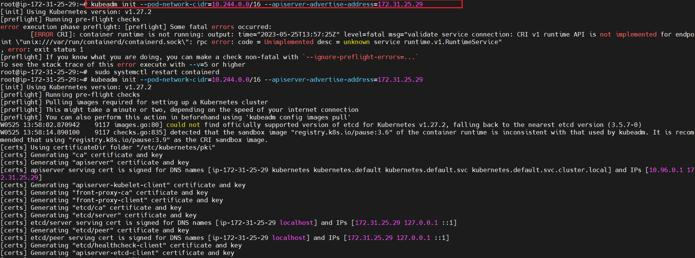
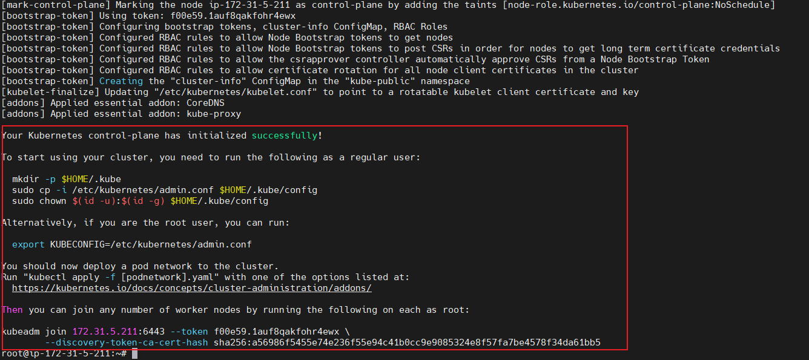
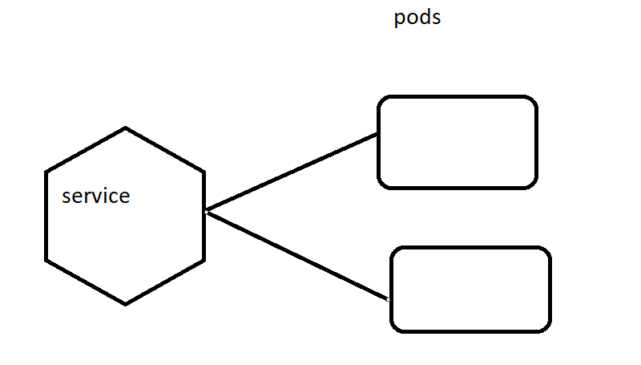
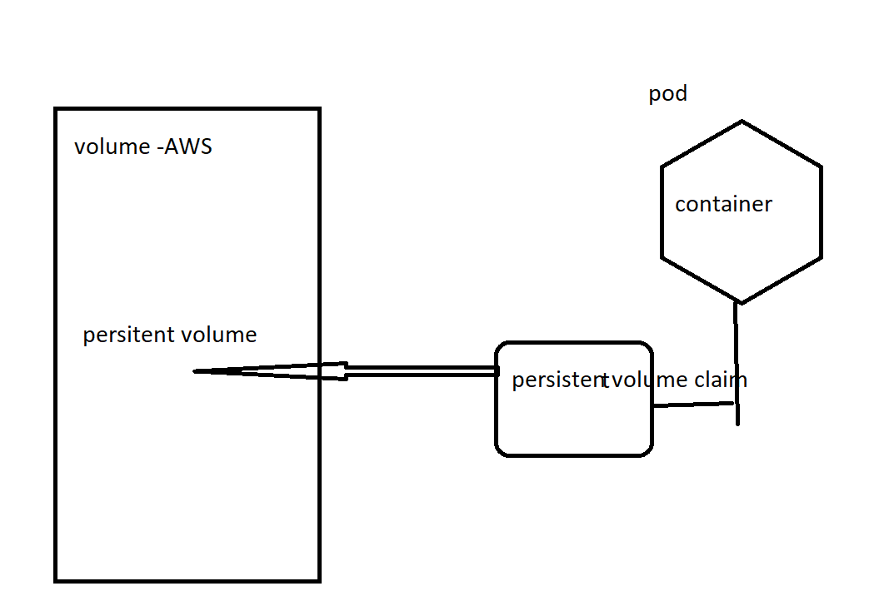
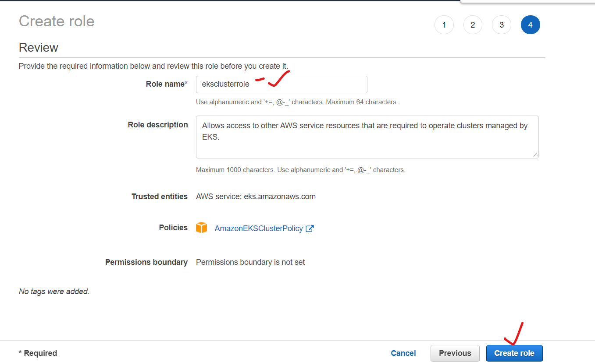
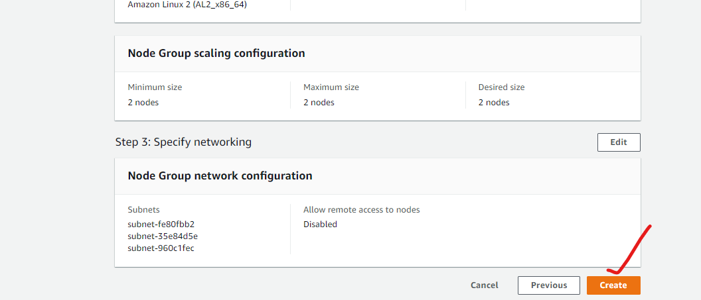
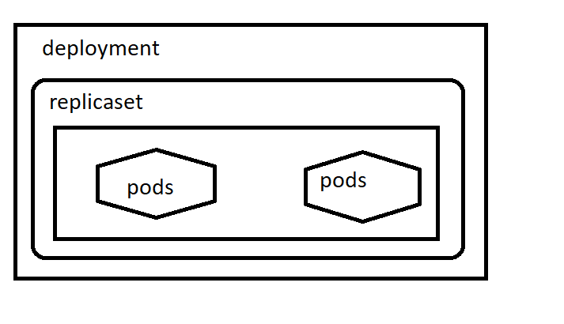

# Kubernetes or K8s :
* Kubernetes (often abbreviated as "K8s") is an open-source container orchestration platform. It provides a way to automate the deployment, scaling, and management of containerized applications. With Kubernetes, you can easily manage complex containerized applications that run across multiple cloud providers or on-premises infrastructure. 

* For the document [REFER HERE ](https://kubernetes.io/docs/concepts/overview/what-is-kubernetes/)

<br/>
<br/>

* * * 

<br/>
<br/>

## Integrate k8s in BasicDevopsPipeline:


<br/>
<br/>

* * * 

<br/>
<br/>


## Why you need Kubernetes and what it can do :
* Automatic scaling .
* Microservices .
* Handle persistent volume .(stateful vs stateless)
* Zero downtime deployments .
* Efficient loadbalancers integrations.
* Monitoring interface

<br/>
<br/>

* * * 

<br/>
<br/>

## Basic architecture of k8s:


# Kubernetes componenets:
* K8s cluster is combination of nodes.
* Nodes are of two types in K8S:
  1. Master node
  2. Worker Node

## Master is referred as the controlplane component:
* Control-plane-Components on master :

1. Kube-apiserver: 
    * The communicaion in the cluster from master to worker-nodes happens from the kube-apiserver.
2. etcd:
    * It is having all the information about the pods and nodes created and destroyed in your cluster.
    * It stores the information in the form of keyvalue pairs.
3. kube-scheduler:
    * It is responsible for scheduling your pods on the nodes.   
4. controller-manager:
    * It takes care of your desired state to be there on the nodes.

## Node components:
1. kubelet:
    * It's like an agent running on your all Worker nodes and takes care of desired state.
2. Kube-proxy: 
    * It helps us to have a communication between the two pods , which are on the differen nodes.
 

<br/>
<br/>
<br/>
<br/>

* * * 

<br/>
<br/>
<br/>
<br/>

## Many ways to setup k8s cluster.
1. Kubeadm
2. EKS (Elastic kubernetes service)
2. AKS (AZURE kubernetes service)

## Setup kubernetes cluster by using kubeadm: [REFER HERE](https://kubernetes.io/docs/setup/production-environment/tools/kubeadm/install-kubeadm/)
* Steps to be followed: 
    1. Take 3 VM's from AWS , having atleat 2 GB RAM
    2. Install container runtime on all the nodes [REFER HERE](https://kubernetes.io/docs/setup/production-environment/container-runtimes/)
    3. Install  kubeadm,kubectl & kubelet  on all nodes [REFER HERE](https://kubernetes.io/docs/setup/production-environment/tools/kubeadm/install-kubeadm/)
    4. Configure Master 
    5. Configure Network 
    6. Join Worker Nodes

## container runtime   
  * A container runtime is a software component responsible for managing and running containers on a host operating system. Containers are lightweight, isolated environments that package applications and their dependencies, allowing them to run consistently across different computing environments.

  * The container runtime provides the necessary functionality to create, start, stop, and manage containers. It interacts with the host operating system's kernel to set up the necessary isolation features, such as namespaces and control groups, which provide process isolation, resource allocation, and security boundaries for the containers.

      ### Some popular container runtimes include:

      * Docker: Docker is one of the most widely used container runtimes. It provides a complete ecosystem for building, distributing, and running containers, including a command-line interface (CLI) and a container image registry.

      * containerd: containerd is an industry-standard container runtime developed under the auspices of the Cloud Native Computing Foundation (CNCF). It focuses on providing a minimalistic, stable, and secure runtime environment.

      * CRI-O: CRI-O is another container runtime developed by the CNCF. It is optimized for running containers that conform to the Kubernetes Container Runtime Interface (CRI) specification, making it a popular choice for Kubernetes deployments.

      * rkt: rkt is a container runtime developed by CoreOS (now part of Red Hat). It emphasizes security, simplicity, and composability, and it supports running both Docker and App Container (appc) format containers.

    These container runtimes facilitate the deployment and management of containers, allowing developers to package applications with their dependencies, ensuring consistent behavior across different environments, and improving resource utilization and scalability.


<br/>

* * * 

<br/>

# Create a k8s cluster with kubeadm : [REFER HERE](https://kubernetes.io/docs/setup/production-environment/tools/kubeadm/install-kubeadm/)

## Before you begin
  * A compatible Linux host. The Kubernetes project provides generic instructions for Linux distributions based on Debian and Red Hat, and those distributions without a package manager.
  * 2 GB or more of RAM per machine (any less will leave little room for your apps).
  * 2 CPUs or more.
  * Full network connectivity between all machines in the cluster (public or private network is fine).
  * Unique hostname, MAC address, and product_uuid for every node. See here for more details.
  * Certain ports are open on your machines. See here for more details.
  * Swap disabled. You MUST disable swap in order for the kubelet to work properly.
  * For example, sudo swapoff -a will disable swapping temporarily. To make this change persistent across reboots, make sure swap is disabled in config files like /etc/fstab, systemd.swap, depending how it was configured on your system
      * Steps to disable swap
       ```
       sudo swapoff -a
       sudo vi  /etc/fstab   -- remove or comment the line with swap
       sudo reboot
       sudo swapon --show    -- If swap is disabled correctly , no output will will be shown 
 
       ```

1. Take 3 VM's from AWS , having atleat 2 GB RAM 2 VCPUS 

  


* ___NOTE__ : Before step-2 , disable swap on all the servers :
  

  
2. Install container runtime  on all the nodes [REFER HERE](https://kubernetes.io/docs/setup/production-environment/container-runtimes/)

### Install and configure prerequisites : [REFERHERE](https://kubernetes.io/docs/setup/production-environment/container-runtimes/#:~:text=Install%20and%20configure%20prerequisites,ip6tables%20net.ipv4.ip_forward)

  * Forwarding IPv4 and letting iptables see bridged traffic
      * Execute the below mentioned instructions:

      ```
        cat <<EOF | sudo tee /etc/modules-load.d/k8s.conf
        overlay
        br_netfilter
        EOF

        sudo modprobe overlay
        sudo modprobe br_netfilter

        # sysctl params required by setup, params persist across reboots
        cat <<EOF | sudo tee /etc/sysctl.d/k8s.conf
        net.bridge.bridge-nf-call-iptables  = 1
        net.bridge.bridge-nf-call-ip6tables = 1
        net.ipv4.ip_forward                 = 1
        EOF

        # Apply sysctl params without reboot
        sudo sysctl --system

      ```

      * Verify that the br_netfilter, overlay modules are loaded by running the following commands:


        ```
        lsmod | grep br_netfilter
        lsmod | grep overlay

        ```

      * Verify that the net.bridge.bridge-nf-call-iptables, net.bridge.bridge-nf-call-ip6tables, and net.ipv4.ip_forward system variables are set to 1 in your sysctl config by running the following command:

        ```
        sysctl net.bridge.bridge-nf-call-iptables net.bridge.bridge-nf-call-ip6tables net.ipv4.ip_forward
  
        ```


### Install Containerd using the apt repository -- [REFERHERE](https://docs.docker.com/engine/install/ubuntu/#:~:text=Install%20using%20the,run%20hello%2Dworld)
  * Before you install Docker Engine for the first time on a new host machine, you need to set up the Docker repository. Afterward, you can install and update Docker from the repository.

  ### Set up the repository
   * Update the apt package index and install packages to allow apt to use a repository over HTTPS:

        ```
          sudo apt-get update
          sudo apt-get install ca-certificates curl gnupg
        ```

  ### Add Docker’s official GPG key:

    
       
          sudo install -m 0755 -d /etc/apt/keyrings
          curl -fsSL https://download.docker.com/linux/ubuntu/gpg | sudo gpg --dearmor -o /etc/apt/keyrings/docker.gpg
          sudo chmod a+r /etc/apt/keyrings/docker.gpg
       
     
     
    
          
          

        

  ### Use the following command to set up the repository:
 
      
        echo \
        "deb [arch="$(dpkg --print-architecture)" signed-by=/etc/apt/keyrings/docker.gpg] https://download.docker.com/linux/ubuntu \
        "$(. /etc/os-release && echo "$VERSION_CODENAME")" stable" | \
        sudo tee /etc/apt/sources.list.d/docker.list > /dev/null
        
      

  ### Install Docker Engine
   * Update the apt package index:

      ```
      sudo apt-get update
      ```
        

  ### Install Docker Engine, containerd, and Docker Compose.

   * To install the latest version, run:

        
      ```
      sudo apt-get install docker-ce docker-ce-cli containerd.io docker-buildx-plugin docker-compose-plugin
      ```
        

  ### Verify that the Docker Engine installation is successful by running the hello-world image.

        
        sudo docker run hello-world
        


### containerd --  [REFER HERE](https://kubernetes.io/docs/setup/production-environment/container-runtimes/#containerd:~:text=change.%20More%20information.-,containerd,io.containerd.grpc.v1.cri%22.containerd.runtimes.runc.options%5D%0A%20%20%20%20SystemdCgroup%20%3D%20true,-The%20systemd%20cgroup):
        
  ### Configuring the systemd cgroup driver  :

   * To use the systemd cgroup driver in /etc/containerd/config.toml with runc, set :

        ```
        [plugins."io.containerd.grpc.v1.cri".containerd.runtimes.runc]
          [plugins."io.containerd.grpc.v1.cri".containerd.runtimes.runc.options]
          SystemdCgroup = true
        ```
   * Restart the containerd service:

          
          sudo systemctl restart containerd

          


3. Install kubelet kubeadm kubectl , run the steps in the document on all nodes [REFER HERE](https://kubernetes.io/docs/setup/production-environment/tools/kubeadm/install-kubeadm/)

      ### Update the apt package index and install packages needed to use the Kubernetes apt repository:

      ```
      sudo apt-get update
      sudo apt-get install -y apt-transport-https ca-certificates curl
      ```

      ### Download the Google Cloud public signing key:

      ```
      sudo curl -fsSLo /etc/apt/keyrings/kubernetes-archive-keyring.gpg https://packages.cloud.google.com/apt/doc/apt-key.gpg

      ```
      * Use below command if above command not works or any issue with gpg keys:
      
      ```
      W: GPG error: https://packages.cloud.google.com/apt kubernetes-xenial InRelease: The following signatures couldn't be verified because the public key is not available: NO_PUBKEY B53DC80D13EDEF05
      ```

      ```
      sudo curl -fsSLo /etc/apt/keyrings/kubernetes-archive-keyring.gpg https://dl.k8s.io/apt/doc/apt-key.gpg
      ```

      ### Add the Kubernetes apt repository:
      
      ```
      echo "deb [signed-by=/etc/apt/keyrings/kubernetes-archive-keyring.gpg] https://apt.kubernetes.io/ kubernetes-xenial main" | sudo tee /etc/apt/sources.list.d/kubernetes.list
      ```

      ### Update apt package index, install kubelet, kubeadm and kubectl, and pin their version:
    
      ```
      sudo apt-get update
      sudo apt-get install -y kubelet kubeadm kubectl
      sudo apt-mark hold kubelet kubeadm kubectl
      ```
      ### NOTE : Check required ports
      * These required ports need to be open in order for Kubernetes components to communicate with each other. You can use tools like netcat to check if a port is open. For example:
      
      ```
      nc 127.0.0.1 6443
      ```


4. Steps to be done on master :

* For document [REFER HERE](https://kubernetes.io/docs/setup/production-environment/tools/kubeadm/create-cluster-kubeadm/)

```
sudo su -
kubeadm init 

```
* Run below steps if your getting error as ``` container runtime is not running```

```
sudo su -
rm /etc/containerd/config.toml
systemctl restart containerd.service
kubeadm init 
```

```
You will be seeing the commands like below , when you run the above command:
==========================================================================
Your Kubernetes control-plane has initialized successfully!

To start using your cluster, you need to run the following as a regular user:

  mkdir -p $HOME/.kube
  sudo cp -i /etc/kubernetes/admin.conf $HOME/.kube/config
  sudo chown $(id -u):$(id -g) $HOME/.kube/config

Alternatively, if you are the root user, you can run:

  export KUBECONFIG=/etc/kubernetes/admin.conf

You should now deploy a pod network to the cluster.
Run "kubectl apply -f [podnetwork].yaml" with one of the options listed at:
  https://kubernetes.io/docs/concepts/cluster-administration/addons/

Then you can join any number of worker nodes by running the following on each as root:

kubeadm join 172.31.5.211:6443 --token f00e59.1auf8qakfohr4ewx \
        --discovery-token-ca-cert-hash sha256:a56986f5455e74e236f55e94c41b0cc9e9085324e8f57fa7be4578f34da61bb5
```





5. Configure  weavenet for network communication on the master -- [REFERHERE](https://kubernetes.io/docs/concepts/cluster-administration/addons/#:~:text=Weave%20Net%20provides%20networking%20and%20network%20policy%2C%20will%20carry%20on%20working%20on%20both%20sides%20of%20a%20network%20partition%2C%20and%20does%20not%20require%20an%20external%20database)

```
kubectl apply -f https://github.com/weaveworks/weave/releases/download/v2.8.1/weave-daemonset-k8s.yaml
```


6. Join  worker nodes :

```
You can now join any number of machines by running the following on each node as root:

kubeadm join <control-plane-host>:<control-plane-port> --token <token> --discovery-token-ca-cert-hash sha256:<hash>
```


## After above steps are done , connect to master and use below commands:
```
kubectl get nodes
```


* ___Note__ : If you are getting The connection to the server x.x.x.:6443 was refused - did you specify the right host or port? Kubernetes [closed] - __Refer below links__ : 
* [Stackoveflow-ClickHere](https://stackoverflow.com/questions/56737867/the-connection-to-the-server-x-x-x-6443-was-refused-did-you-specify-the-right)
* [Kubernetes.io-ClickHere](https://discuss.kubernetes.io/t/the-connection-to-the-server-host-6443-was-refused-did-you-specify-the-right-host-or-port/552/5)
* [Kubernetes.io-ClickHere](https://discuss.kubernetes.io/t/the-connection-to-the-server-host-6443-was-refused-did-you-specify-the-right-host-or-port/552/43?page=3)


## Check the master components by using below command on Master-node :

```
kubectl get pods -n kube-system

```


* All the controller plane configs are available in the path -- /etc/kubernetes/manifests


<br/>

* * * 

<br/>


## Working with k8s :
* We will be creating a image that has the latest build code(.war/.jar).
* The image created has to be deployed to the k8s cluster in the form of pod.
* To deploy the image in to K8s cluster in the form of POD, we write a file called ___manifest file__ or ___deployment.yaml file__

## API-REFERENCE :
* For api-refernce [REFER HERE](https://kubernetes.io/docs/reference/kubernetes-api/) and for version1.27 [REFER HERE](https://kubernetes.io/docs/reference/generated/kubernetes-api/v1.27/)
* We will be using the api-reference internally when we are using the kubectl to communicate with the cluster.

## Understanding POD :


* Pod can be defined as the basic unit of execution in k8s.
* Pod will have docker container.
* Pod will have application container, storage and network.
* Pod can run single or multiple containers inside it.
* Running one-application-container per pod is best usecase.


<br/>

* * * 

<br/>

## Create  a ___manifest file__ or ___deployment.yaml file__ for nginx Pod  : [REFER HERE](https://kubernetes.io/docs/reference/generated/kubernetes-api/v1.27/ )


```
---
apiVersion: v1
kind: Pod
metadata: 
  name: myfirstpod
  labels:
    app: myapp
    type: frontend
spec:
  containers: 
    - name: nginx
      image: nginx 
```

* Connect to the k8s master and try to use above manifest to create a pod.

```
vi pod.yml                 -- Add above content to the file
kubectl apply -f pod.yml   -- create a pod 
kubecl get nodes           -- list nodes in k8s 
kubectl get pods           -- list pods in default namespace
kubectl get pods -o wide   -- list pods along with on which node they are running
kubectl get po             -- po is short form of pods
kubectl delete -f pod.yml  -- delete the pod created
```


<br/>
<br/>

* * * 

<br/>
<br/>


## CONTROLLERS :
* Pod are not the durable entities 
* To make sure the pods are running all the time , we will be using controllers.
* Controllers wil be taking care of the desired state .
* In a k8s cluster it is not a  best pracice to create pod for your application,  we will be creating a pod with controllers.

### Controllers in K8s:
 1. ReplicationController
 2. ReplicaSet
 3. Deployments
 4. SatefulSets
 5. DaemonSets
 6. Jobs
 7. CronJOb

##  ReplicationController:
* It make sures that the specified number of pods to be running all the time.
* Create a yaml/manifest file for the ReplicationController
* For the ReplicationController reference  [REFER HERE](https://kubernetes.io/docs/reference/generated/kubernetes-api/v1.20/#replicationcontroller-v1-core)


```
---
apiVersion: v1
kind: ReplicationController
metadata:
  name: nginx
  labels:
    app: myapp
    type: frontend
spec: 
  replicas: 3
  template:
    metadata: 
      name: nginx
      labels: 
        app: myapp
        type: frontend
    spec: 
      containers: 
        - name: nginx
          image: nginx
```

* Run below commands to apply Replicationcontroller
```
kubectl apply -f rc.yml
kubectl get rc
```


* ___Note__ : Delete the pod manuallly and see the working of ReplicationController


## Replicaset:
* It also acts same like  replication controller .
* The difference between the ReplicationController vs ReplicaSet is , the ReplicationController is old object and ReplicaSet is new object which has extra features like selector when you compare with the ReplicationController

* ReplicaSet Manifestfile :

```
---
apiVersion: v1
kind: ReplicationController
metadata:
  name: nginx
  labels:
    app: myapp
    type: frontend
spec: 
  replicas: 3
  template:
    metadata: 
      name: nginx
      labels: 
        app: myapp
        type: frontend
    spec: 
      containers: 
        - name: nginx
          image: nginx
  selector:
    matchLabels:
      app:myapp

```


## Imperative vs Declarative way of working with K8s :

* In Kubernetes, there are two primary approaches to working with resources: imperative and declarative.

### Imperative Approach:
* The imperative approach involves giving explicit commands to the Kubernetes API to perform specific actions. It focuses on specifying the exact steps to be executed. Some examples of imperative commands include creating resources, updating configurations, and scaling replicas.
With the imperative approach, you directly interact with the Kubernetes command-line interface (CLI) using commands like kubectl. For instance, you might run kubectl create deployment to create a deployment or kubectl scale deployment to scale the number of replicas.

* Benefits of the imperative approach include its simplicity, quick feedback, and easy ad hoc modifications. It is well-suited for tasks that require immediate changes or troubleshooting. However, managing complex deployments can become challenging, as it may involve handling multiple commands and managing configurations manually.

* Example :

```
kubectl run nginx --image=nginx
```

## Declarative Approach:
* The declarative approach involves defining the desired state of resources using YAML or JSON manifests. You specify the desired configuration, and Kubernetes takes responsibility for reconciling the actual state with the desired state.
You create manifest files that describe the desired state of resources, such as deployments, services, and ingress rules. You then use kubectl to apply the manifest files, and Kubernetes handles the process of creating, updating, or deleting resources to match the desired state.

* The benefits of the declarative approach include reproducibility, consistency, and version control of configurations. It simplifies the management of complex deployments, as you can easily track and apply changes to the desired state. It also facilitates collaboration and automation through version control systems and continuous integration/continuous deployment (CI/CD) pipelines.

Overall, the declarative approach is considered the recommended way of working with Kubernetes, as it aligns with the desired state management philosophy of the platform. It provides better control and manageability over resources in the long run, especially for complex applications and infrastructure.

## Deployment:
* It is a controller used to deploy the new version of your code, with the help of providing version numbers.

## Jobs and Cronjobs :
* Jobs are used to call the script/command in the containers.

## DaemonSet:
* These are the pods running on every node in k8s cluster and do our job.

## k8s cluster Neworking:
* For any k8s cluster , below are the things o be addresed:
 * container-conatiner communication
 * pod to pod communication
 * Pod to service communication
 * External to service communication


## Service:


* For document [REFER HERE](https://kubernetes.io/docs/reference/generated/kubernetes-api/v1.20/#service-v1-core)

```
---
kind: Service
apiVersion: v1
metadata:
  name: service-example
spec:
  type: NodePort
  ports:
      - port: 80
        targetPort: 80
        nodePort: 32000
  selector:
    app: nginx

```

* To publish ports , we have following types:
* ClusterIP: Exposes service on clusteripinternal address. Default type
* NodePort: If you want to expose the service on the node on which pod is running.
* Loadbalancer: Exposes the service externaly using cloud loadbalancers.

* Take an example from replicationController:

```
---
apiVersion: v1
kind: ReplicationController
metadata:
  name: replicationcontroller-example
spec:
  replicas: 3
  template:
    metadata:
      labels:
        app: nginx
    spec:
      containers:
      - name: nginx
        image: nginx:1.14

```

```
kubectl get svc 
kubectl describe service <servicename>
kubectl describe pod <podname>
```


## k8s storages:
* In K8s , when ever the pod is deleted , the data produced by the pod is also deleted.
* Inorder to not having data loss , the concept of persistent volumes came in to picture.

* K8s gives us following ways of storage:
   * volumes
   * Persistent volumes
       * Persistent volume claims
       * storage classes
* In the volumes the behaviour is , whenever the pod is deleted the volume is also deleted.


# Persistent volume:
* To make persistent volume available to the pod , we need to follow below things:
   1. create a volume manually
   2. Make it available for the k8s (persistent volume)
   3. Make it available to the pod (persistent volume claims)

* we have two way of provisioning:
1. Static provisioning
2. Dynamic provisioning

## Static provisioning:
   1. create a volume manually
   2. Make it available for the k8s (persistent volume)
   3. Make it available to the pod (persistent volume claims)

## Dynamic provisioning:
   1. We will be creating storage class
   2. We will be claiming the persistent volume claim directly.


## Access modes to the volumes :
   * ReadWriteOnce
   * ReadOnlyMany
   * ReadWriteMany

* For Accesmodes [REFERHERE](https://kubernetes.io/docs/concepts/storage/persistent-volumes/#access-modes)


## Reclaim policy:
* If the persistent volume claim is deleted , what happens to your data :
* Reclaim policy :
   1. Retain
   2. Recycle
   3. Delete

<br/>
<br/>
<br/>
<br/>

* * * 

<br/>
<br/>
<br/>
<br/>

## AKS (AZURE KUBERNETES SERVICE):
* In AKS the master is free of cost and it is managed by the AZURE.
## EKS (ELASTIC KUBERNETES SERVICE):
* In EKS the master is not free of cost and it is managed by AWS.


## To create a EKS cluster follow below steps :
1. Create a role with AmazonEKSClusterPolicy attached and call it as eksclusterrole



2. Create a EKS cluster from the AWS console.


3. Create a ubuntu instance and install the Kubectl , IAM authenticator , aws cli 
    * Install kubectl -- [REFERHERE](https://docs.aws.amazon.com/eks/latest/userguide/install-kubectl.html)
    * Install IAM Authenticator -- [REFERHERE](https://docs.aws.amazon.com/eks/latest/userguide/install-aws-iam-authenticator.html)
    * Install AWS CLI -- [REFERHERE](https://docs.aws.amazon.com/cli/latest/userguide/install-cliv2-linux.html)

4. Must have a user with admin access and configure the user with your instance by using aws-cli.

```
aws configure 
```

* Run below command to get the config file downloaded
```
aws eks --region <region> update-kubeconfig --name <clustername>

aws eks --region us-west-1 update-kubeconfig --name ekscluster

```


* To check the kubectl configured correctly try the below command

```
kubectl get svc 
kubectl get nodes
```


5. Create a IAM role for EKS worker nodes with AmazonEKS_CNI_Policy , AmazonEKSWorkerNodePolicy, AmazonEc2ContainerRegistryReadOnly


6. Create/add a nodegroup to the cluster  from AWS console.





* For the sample twotire code deployment [REFERHERE](https://github.com/learnitguide/kubernetes-knote)

<br/>
<br/>
<br/>
<br/>

* * * 

<br/>
<br/>
<br/>
<br/>

## To create a EKS cluster by using eksctl  follow below steps :

### Prerequisites:
1. Need a ssh key in the required region
2. Create a ubuntu instance and install the Kubectl , IAM authenticator , aws cli 
    * Install kubectl -- [REFERHERE](https://docs.aws.amazon.com/eks/latest/userguide/install-kubectl.html)
    * Install IAM Authenticator -- [REFERHERE](https://docs.aws.amazon.com/eks/latest/userguide/install-aws-iam-authenticator.html)
    * Install AWS CLI -- [REFERHERE](https://docs.aws.amazon.com/cli/latest/userguide/install-cliv2-linux.html)
    * Install eksctl -- [REFERHERE](https://docs.aws.amazon.com/eks/latest/userguide/eksctl.html)
3. Must have a user with admin access and configure the user with your instance by using aws-cli.

```
aws configure 
```


4. Run the below command  to create the cluster .

```
eksctl create cluster \
--name eks-cluster-demo \
--region us-west-2 \
--nodegroup-name eks-cluster-demo-nodegroup \
--node-type t3.medium \
--nodes 2 \
--nodes-min 2 \
--nodes-max 2 \
--ssh-access \
--ssh-public-key june_9_2021 \
--managed 

```

5. Run the below command to destroy the cluster :

```
eksctl delete cluster --name my-cluster --region us-west-2
eksctl delete cluster --name eks-cluster-demo --region us-west-2

```


* To check the storage class:
```
kubectl get sc
```

## Create a storageclass 

```
apiVersion: storage.k8s.io/v1
kind: StorageClass
metadata:
  name: standard
provisioner: kubernetes.io/aws-ebs
parameters:
  type: gp2
reclaimPolicy: Retain
allowVolumeExpansion: true
mountOptions:
  - debug
volumeBindingMode: Immediate
```

* To create a storage class use below command 

```
kubectl apply -f sc.yml
```

## persistent volume claim:

```
apiVersion: v1
kind: PersistentVolumeClaim
metadata:
  name: myclaim
spec: 
  accessModes:
    - ReadWriteOnce
  storageClassName: standard
  resources: 
    requests:
      storage: 1Gi
```
* To create PVC use below command:

```
kubectl apply -f pvc.yaml
```
<br/>
<br/>
<br/>
<br/>

* * * 

<br/>
<br/>
<br/>
<br/>

## Exercise:
* Analyse how to add a PVC to a pod in eks .

* Attaching PVC to a pod:

```
---
apiVersion: v1
kind: Pod
metadata:
  name: mypod
spec:
  containers:
  - name: mypod
    image: nginx
    resources:
      requests:
        cpu: 100m
        memory: 128Mi
      limits:
        cpu: 250m
        memory: 256Mi
    volumeMounts:
    - mountPath: "/usr/lib/nginx/"
      name: volume
  volumes:
    - name: volume
      persistentVolumeClaim:
        claimName: myclaim

```
<br/>
<br/>
<br/>
<br/>

* * * 

<br/>
<br/>
<br/>
<br/>

## k8s Deployments:
* In K8s , there is a api object of deployment .
* In the deployment api object , the replicaset will be the default controller.


* K8s deployment is also providing you an option of zero downtime deployment.
* K8s deploymet gives us the following options:
  1. Rolling update (zerodowntime deployment)
  2. Recreation  (downtime deployment)
* In rolling update we have an option of rollback the code.
* By default the behaviour of k8s deployment is rolling update.


## scenario of creating three jenkins pods with rolling update:
* the yaml file looks below:

```
apiVersion: apps/v1
kind: Deployment
metadata:
  # Unique key of the Deployment instance
  name: jenkins-deploy
spec:
  replicas: 3
  selector:
    matchLabels:
      app: jenkins
  strategy:
    type: RollingUpdate    
    rollingUpdate:
      maxSurge: 50%
      maxUnavailable: 25% 
  template:
    metadata:
      labels:
        # Apply this label to pods and default
        # the Deployment label selector to this value
        app: jenkins
        ver: "1.0"
    spec:
      containers:
      - name: jenkins
        # Run this image
        image: jenkins:1.642.4
```

## Exposing the above deployment.yaml to the outside world:
* By using svc 

```
apiVersion: v1
kind: Service
metadata:
  name: jenkins-svc
spec:
  selector:
    app: jenkins
  ports:
    - name: http
      port: 80
      targetPort: 8080
  type: LoadBalancer
```

* Use the below commands as reference 
```
kubectl apply -f deployment.yml
kubectl get all
kubectl rollout history deployments jenkins-deploy
kubectl apply -f deployment.yml --record
kubectl get pods
kubectl get pods -w
kubectl rollout history deployments jenkins-deploy
kubectl rollout undo deployments jenkins-deploy --to-revision=1
```

## statefulset  and stateless set:

## ConfigMap and secrets:
* For any application to be running , we will be havings some configuration
* In config map , we can store the key value pairs and attach to the pod.


* Create a configmap as below:

```
apiVersion: v1
kind: ConfigMap
metadata:
  name: sample
data:
  name: devops-surya
```
* create a pod with above confimap:

```
apiVersion: v1
kind: Pod
metadata:
  name: alpine-pod
spec: 
  containers:
    - image: alpine
      name: alpine
      envFrom:
        - configMapRef:
            name: sample

```

## secrets:
* For official document of secrets [REFER HERE](https://kubernetes.io/docs/concepts/configuration/secret/)


## Namespaces:

--namespce=dev

## labels and annotations:
* Search thhe pods with labels :
```
kubectl get pods --selector="app=jenkins
```

## Horizontal pod autoscaling (HPA):
* we can define a condition to the pod for auto scaling:

```
kubectl autoscale deployment jenkins-deploy --cpu-percentage=50 --min=1 --max=10
```

* Manually autoscale:

```
kubectl scale deployments jenkins-deploy --replicas=5
```

## Taints and Tolerations , NodeAffinity: 
* For document refer here [REFER HERE](https://kubernetes.io/docs/concepts/scheduling-eviction/taint-and-toleration/)


