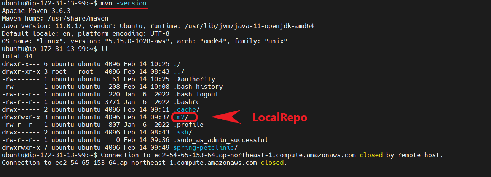

# MAVEN & JENKINS


# Maven:
* Maven is a build automation tool used primarily for Java projects.

## Build tools
   * c => Make, GCC
   * Java => Ant, Maven, Gradle
   * .net => MSBuild, dotnet build

## Install maven 

```
sudo apt update
sudo apt install maven
mvn -version
```
<br/>

* * * 
<br/>

## MAVEN GOALS:

* ***compile***: This goal compiles the source code of the project and creates the class files.

* ***test***: This goal runs the unit tests of the project.

* ***package***: This goal packages the compiled code and resources into a distributable format, such as a JAR, WAR, or ZIP file.

* ***install***: This goal installs the packaged artifact into the local repository, making it available for other projects to use.

* ***clean***: This goal removes all the generated files and directories created by the previous build.

* ***deploy***: This goal deploys the packaged artifact to a remote repository or a remote server.

```
mvn test = mvn compile + mvn test
mvn package = mvn compile + mvn test + mvn package
mvn clean package = mvn clean + mvn compile + mvn test + mvn package
```
<br/>

* * * 
<br/>

## Build the code manually using maven:

* Clone the code from github.

```
git clone https://github.com/devops-surya/SampleMavenProject.git
cd SampleMavenProject
```
  

* ***mvn package***

  
  
* ***mvn install***

  

* ***mvn clean install*** 
  


<br/>

* * * 
<br/>


## Types of Maven repositories :  Local, Central & Remote

  


* Maven supports three types of repositories:

    * **Local repository** : This is the local cache where Maven stores the downloaded artifacts on the developer's machine. By default, it's located in the .m2 directory in the user's home directory.

    * **Remote repository** : This is a network location, usually an HTTP or HTTPS URL, where Maven can download the required artifacts. Remote repositories can be public or private, and they can be hosted on a local network or on the internet.

    * **Central repository** : Maven comes with a default set of remote repositories, such as the Maven Central Repository and the JBoss Community Repository. However, you can also configure custom repositories in your POM file, either by specifying their URLs or by setting up a repository manager that can host and manage your custom repositories.

* ***NOTE***: When you add a dependency to your project's POM file, Maven first checks the local repository for the dependency. If it's not found, it then checks the remote repositories configured in the POM file. If the dependency is not found in any of the configured repositories, the build process fails with an error.




<br/>

* * * 
<br/>


## pom.xml : 

* In Maven, the Project Object Model (POM) is an XML file called pom.xml that describes the project and its configuration. The POM file is located at the root of the project's directory and contains information about the project's name, version, dependencies, build process, and more.

 


<br/>
<br/>
<br/>
<br/>

* * * 

<br/>
<br/>
<br/>
<br/>


# Jenkins:
* Jenkins is an open source continuous integration/continuous delivery and deployment (CI/CD) automation software DevOps tool written in the Java programming language. It is used to implement CI/CD workflows, called pipelines.
* Jenkins is a ci/cd tool
* ci -- continous integration 
* cd -- continous delivery / continous deployment

## Basic flow of devops :


