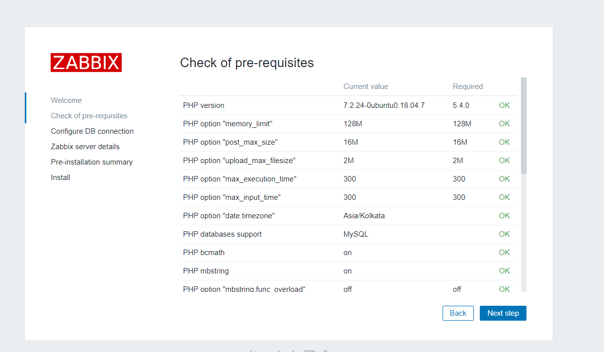
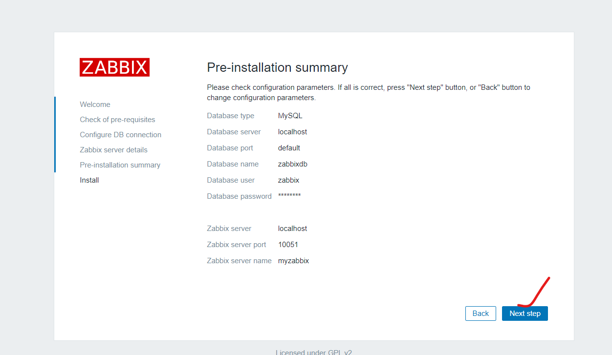

# ZABBIX :
* Zabbix is an open-source monitoring solution that allows you to monitor the performance and availability of various IT components such as servers, networks, applications, and services. It uses a client-server architecture, where the Zabbix server collects data from the monitored devices using various methods such as SNMP, JMX, SSH, and more.

* Zabbix can monitor and collect a wide range of metrics such as CPU usage, memory usage, network bandwidth, disk usage, and more. It can also monitor the status of various services, processes, and applications.

* Zabbix provides a web-based interface that allows you to configure the monitoring, view the collected data, and generate reports. It also supports triggers, which can be used to notify administrators when specific events occur, and actions, which can be used to automate responses to events.

* Overall, Zabbix is a powerful and flexible monitoring solution that can help organizations monitor the health and performance of their IT infrastructure.
* Baisc monioring things in zabbix:


## Basic architecture of zabbix:


## ZABBIX-SERVER-INSTALLATION :

* For document [REFER HERE](https://www.layerstack.com/resources/tutorials/How-to-install-ZABBIX-on-Ubuntu22)

## Step 1 – Install Apache, MySQL and PHP
* Installing necessary modules 

```
sudo apt-get update
sudo apt-get install apache2 libapache2-mod-php
sudo apt-get install mysql-server
sudo apt-get install php php-mbstring php-gd php-xml php-bcmath php-ldap php-mysql
```

## Update timezone in php configuration file /etc/php/PHP_VERSION/apache2/php.ini. Like below:

```
[Date]
; http://php.net/date.timezone
date.timezone = 'Asia/Kolkata'
```
## Step 2 – Enable Required Apt Repository

```
wget https://repo.zabbix.com/zabbix/6.2/ubuntu/pool/main/z/zabbix-release/zabbix-release_6.2-2%2Bubuntu22.04_all.deb 
sudo dpkg -i zabbix-release_6.2-2+ubuntu22.04_all.deb
```

## Step 3 – Install Zabbix Server

```
sudo apt-get update
sudo apt-get install zabbix-server-mysql zabbix-frontend-php zabbix-apache-conf zabbix-sql-scripts -y
```

## Step 4 – Create Database Schema:

* ***NOTE***: For below step give password = root
```
sudo mysql -u root -p 

mysql> create database zabbix character set utf8mb4 collate utf8mb4_bin;
mysql> create user zabbix@localhost identified by 'password';
mysql> grant all privileges on zabbix.* to zabbix@localhost;
mysql> set global log_bin_trust_function_creators = 1;
mysql> exit
```

* ***NOTE***: For below step give password = password
```
zcat /usr/share/zabbix-sql-scripts/mysql/server.sql.gz | mysql --default-character-set=utf8mb4 -uzabbix -p zabbix
```

* ***NOTE***: For below step give password = root
```
sudo mysql -u root -p 

mysql> set global log_bin_trust_function_creators = 0;
mysql> exit


```

## Step 5 – Edit Zabbix Configuration File

* /etc/zabbix/zabbix_server.conf
```
  DBHost=localhost
  DBName=zabbix
  DBUser=zabbix
  DBPassword=password
  JavaGateway=127.0.0.1
  JavaGatewayPort=10052
  StartJavaPollers=5
```

## Step 6 – Restart Apache and Zabbix

```
sudo service apache2 restart
sudo service zabbix-server restart

```

* TO open in browser:
```
publicip/zabbix
```

*  Follow the below images after installation is completed:








* Provide username as Admin and password as password:


# ZABBIX-AGENT-INSTALLATION :
## Step 1 – Enable Apt Repository :

* For Ubuntu 18.04 (Bionic):

```
wget https://repo.zabbix.com/zabbix/4.0/ubuntu/pool/main/z/zabbix-release/zabbix-release_4.0-3+bionic_all.deb
sudo dpkg -i zabbix-release_4.0-3+bionic_all.deb
```

* For Ubuntu 16.04 (Xenial):

```
wget https://repo.zabbix.com/zabbix/4.0/ubuntu/pool/main/z/zabbix-release/zabbix-release_4.0-3+xenial_all.deb
sudo dpkg -i zabbix-release_4.0-3+xenial_all.deb
```

## Step 2 – Install Zabbix Agent :

```
sudo apt-get update
sudo apt-get install zabbix-agent
```

## Step 3 – Configure Zabbix Agent:

* sudo vi /etc/zabbix/zabbix_agentd.conf

```
#Server=[zabbix server ip]
#Hostname=[Hostname of client system ]

Server=192.168.1.10
Hostname=Server2
```

## Step 4 – Restart Zabbix Agent:

```
sudo systemctl enable zabbix-agent 
sudo systemctl start zabbix-agent 

sudo systemctl stop zabbix-agent 
sudo systemctl status zabbix-agent
```