# ZABBIX :
* Zabbix is an open-source monitoring solution that allows you to monitor the performance and availability of various IT components such as servers, networks, applications, and services. It uses a client-server architecture, where the Zabbix server collects data from the monitored devices using various methods such as SNMP, JMX, SSH, and more.

* Zabbix can monitor and collect a wide range of metrics such as CPU usage, memory usage, network bandwidth, disk usage, and more. It can also monitor the status of various services, processes, and applications.

* Zabbix provides a web-based interface that allows you to configure the monitoring, view the collected data, and generate reports. It also supports triggers, which can be used to notify administrators when specific events occur, and actions, which can be used to automate responses to events.

* Overall, Zabbix is a powerful and flexible monitoring solution that can help organizations monitor the health and performance of their IT infrastructure.
* Baisc monioring things in zabbix:

<br/>

* * * 

<br/>


## Basic architecture of zabbix :

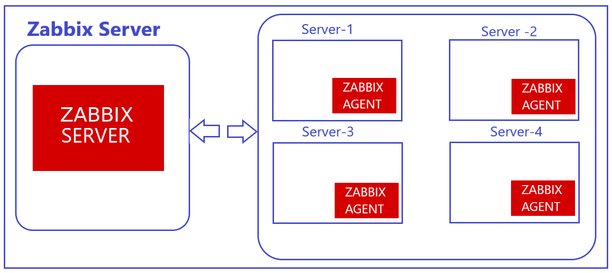


<br/>

* * * 

<br/>

# ZABBIX-SERVER-INSTALLATION :

* For document [REFER HERE](https://www.layerstack.com/resources/tutorials/How-to-install-ZABBIX-on-Ubuntu22)
* ***Note***: t2.medium is preferrable 
## Step 1 – Install Apache, MySQL and PHP
* Installing necessary modules 

```
sudo apt-get update
sudo apt-get install apache2 libapache2-mod-php
sudo apt-get install mysql-server
sudo apt-get install php php-mbstring php-gd php-xml php-bcmath php-ldap php-mysql
```

## Update timezone in php configuration file /etc/php/PHP_VERSION/apache2/php.ini Like below:
* vi /etc/php/PHP_VERSION/apache2/php.ini 

```
[Date]
; http://php.net/date.timezone
date.timezone = 'Asia/Kolkata'
```
## Step 2 – Enable Required Apt Repository

```
wget https://repo.zabbix.com/zabbix/6.2/ubuntu/pool/main/z/zabbix-release/zabbix-release_6.2-2%2Bubuntu22.04_all.deb 
sudo dpkg -i zabbix-release_6.2-2+ubuntu22.04_all.deb
```

## Step 3 – Install Zabbix Server

```
sudo apt-get update
sudo apt-get install zabbix-server-mysql zabbix-frontend-php zabbix-apache-conf zabbix-sql-scripts zabbix-agent -y
```

## Step 4 – Create Database user & Schema:

* ***NOTE***: For below step give password = root
```
sudo mysql -u root -p 

mysql> create database zabbix character set utf8mb4 collate utf8mb4_bin;
mysql> create user zabbix@localhost identified by 'password';
mysql> grant all privileges on zabbix.* to zabbix@localhost;
mysql> set global log_bin_trust_function_creators = 1;
mysql> exit
```

* ***NOTE***: For below step give password = password
```
zcat /usr/share/zabbix-sql-scripts/mysql/server.sql.gz | mysql --default-character-set=utf8mb4 -uzabbix -p zabbix
```

* ***NOTE***: For below step give password = root
```
sudo mysql -u root -p 

mysql> set global log_bin_trust_function_creators = 0;
mysql> exit


```
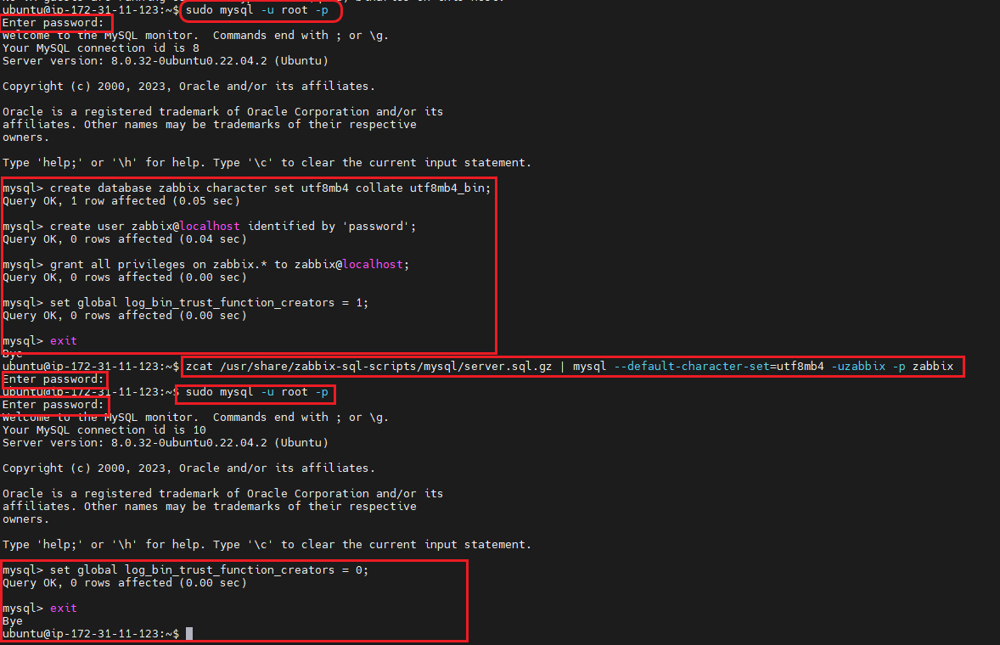


## Step 5 – Edit Zabbix Configuration File

* sudo vi /etc/zabbix/zabbix_server.conf
```
  DBHost=localhost
  DBName=zabbix
  DBUser=zabbix
  DBPassword=password
  JavaGateway=127.0.0.1
  JavaGatewayPort=10052
  StartJavaPollers=5
```
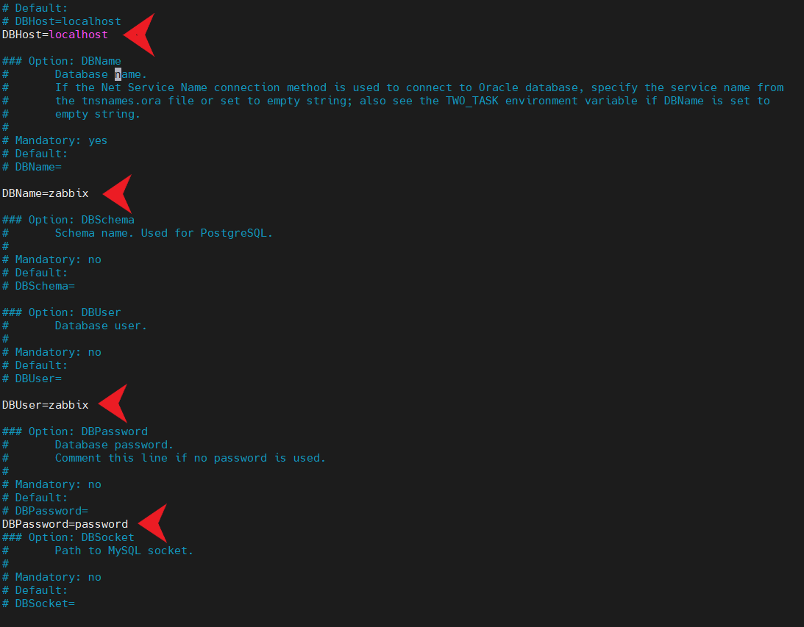


## Step 6 – Restart Apache and Zabbix

```
sudo systemctl enable apache2
sudo systemctl enable zabbix-server  
sudo systemctl restart  apache2
sudo systemctl restart zabbix-server
```

* Open zabbix in browser :
```
publicip/zabbix
```

* Follow the below images after installation is completed:
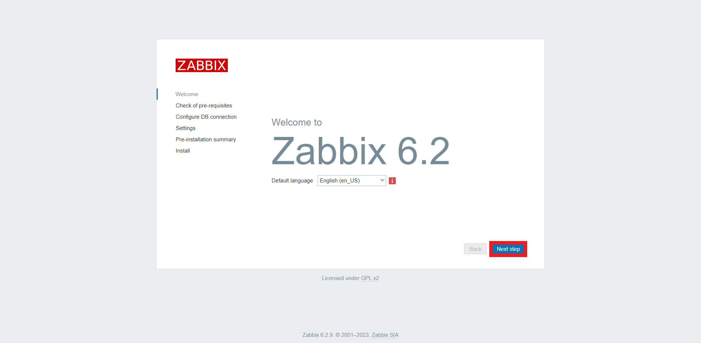
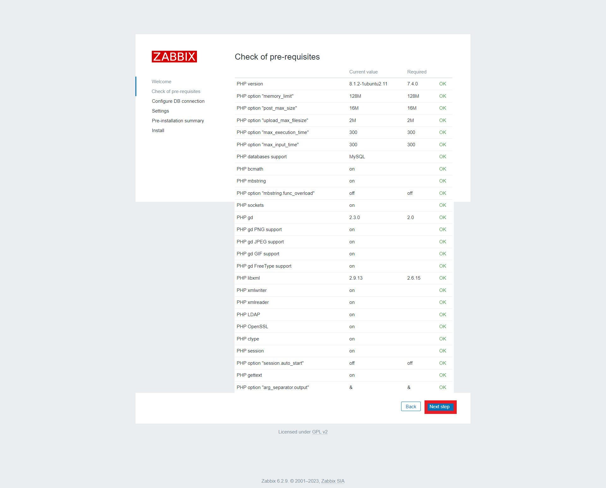

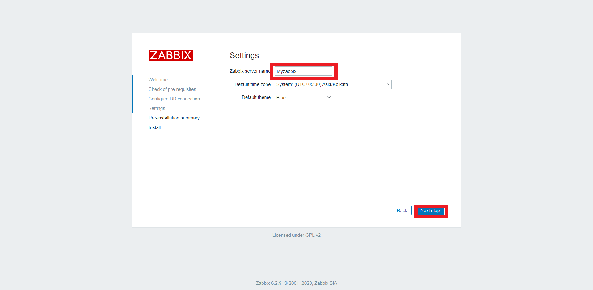
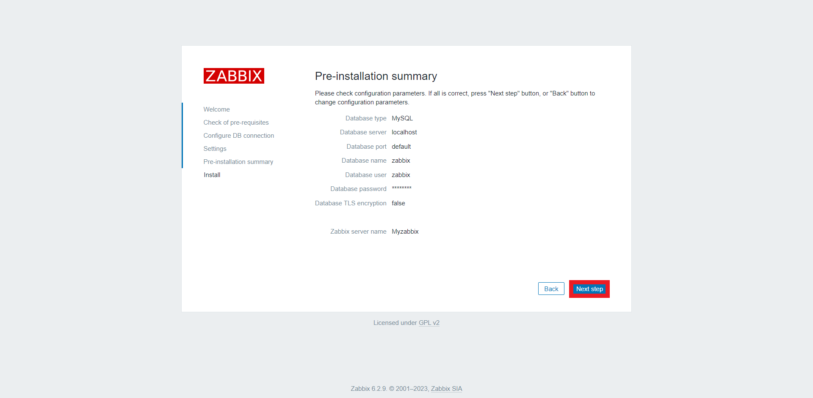
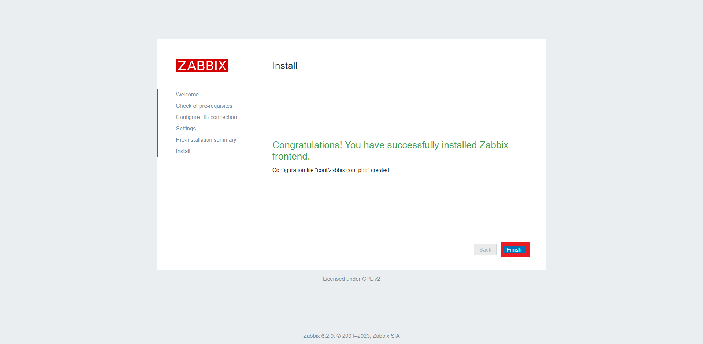
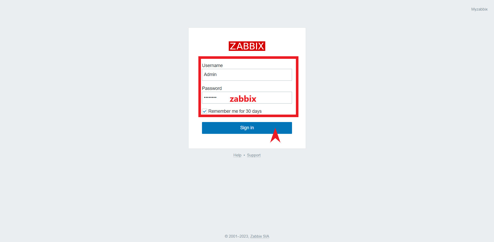
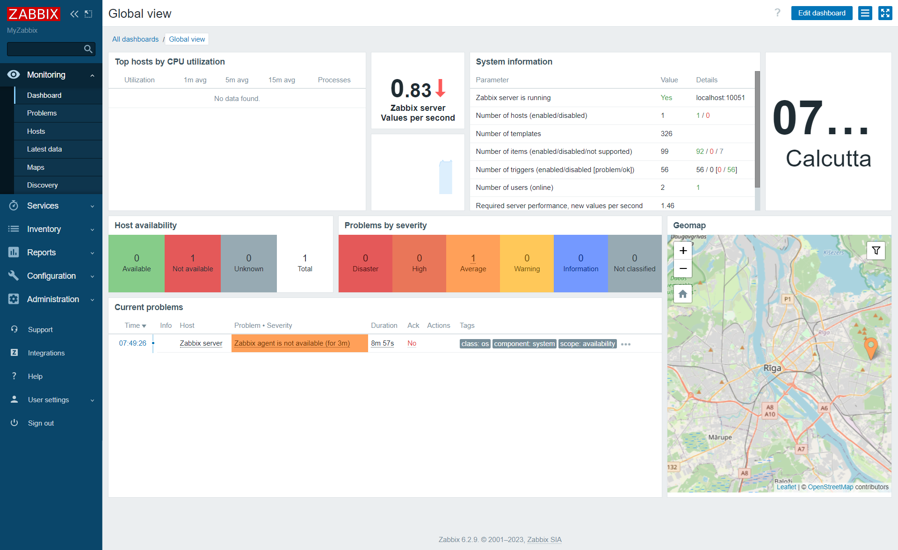

<br/>

* * * 

<br/>

# ZABBIX-AGENT-INSTALLATION :
## Step 1 – Enable Apt Repository :

```
wget https://repo.zabbix.com/zabbix/6.2/ubuntu/pool/main/z/zabbix-release/zabbix-release_6.2-2%2Bubuntu22.04_all.deb 
sudo dpkg -i zabbix-release_6.2-2+ubuntu22.04_all.deb
```

## Step 2 – Install Zabbix Agent :

```
sudo apt-get update
sudo apt-get install zabbix-agent
```

## Step 3 – Configure Zabbix Agent:

* sudo vi /etc/zabbix/zabbix_agentd.conf

```
#Server=[zabbix server ip]
#Hostname=[Hostname of client system ]

Server=192.168.1.10
Hostname=Server1
```

## Step 4 – Restart Zabbix Agent:

```
sudo systemctl enable zabbix-agent 
sudo systemctl start zabbix-agent 

sudo systemctl stop zabbix-agent 
sudo systemctl status zabbix-agent
```

<br/>

* * * 

<br/>

# Zabbix Dashboard components : 

## Hosts & Host groups :
* In Zabbix, hosts and host groups are two fundamental concepts that are used to organize and manage the monitoring of devices and systems.

    * Hosts: A host in Zabbix represents a device, system, or service that needs to be monitored. Examples of hosts include servers, network switches, routers, and applications. Each host is identified by a unique name or IP address, and it is assigned one or more templates that define what metrics to monitor, how to monitor them, and how to alert administrators when there is a problem.

    * Host groups: A host group in Zabbix is a logical grouping of hosts. Host groups make it easy to manage large numbers of hosts by allowing administrators to apply the same monitoring settings and templates to multiple hosts at once. For example, you might create a host group called "Web Servers" that includes all the servers that host web applications. You can then apply a template for monitoring Apache or Nginx to this host group, and Zabbix will automatically monitor all the servers in the group using the same settings.


## Items , Triggers & Actions :
* In Zabbix, items, triggers, and actions work together to detect and respond to problems in monitored hosts.

    * Items: An item in Zabbix is a metric that is collected from a monitored host, such as CPU usage, memory usage, network traffic, or disk space. Items are defined using a variety of parameters, including the host from which the data is collected, the specific metric being monitored, the type of data being collected, the unit of measurement, and the interval at which the data is collected.

    * Triggers: A trigger in Zabbix is a condition that is defined based on the values of one or more items. Triggers are used to detect when a problem has occurred in a monitored host. When the condition defined in a trigger is met, the trigger is activated, generating an event in Zabbix.

    * Actions: An action in Zabbix is a set of operations that are performed in response to a trigger. Actions can include sending notifications to administrators, running scripts or commands, or executing other types of automated responses. Actions can be defined based on a variety of conditions, such as the severity of the trigger or the time of day.

* Together, items, triggers, and actions form the basis of Zabbix's monitoring and alerting system. By defining items to collect metrics from monitored hosts, triggers to detect when problems occur, and actions to respond to those problems, administrators can quickly identify and address issues in their infrastructure, minimizing downtime and improving the overall health and performance of their systems.


## Template & Template groups :
* In Zabbix, templates and template groups are used to define and manage monitoring settings for hosts. Templates are pre-configured sets of monitoring items, triggers, and graphs that can be applied to multiple hosts, while template groups are used to organize and manage templates.

    * Templates: A template in Zabbix is a pre-configured set of monitoring items, triggers, and graphs that can be applied to multiple hosts. Templates make it easy to standardize monitoring settings across multiple hosts that have similar configurations or roles. For example, you might create a template for monitoring web servers that includes items for monitoring CPU usage, memory usage, and network traffic. You can then apply this template to all the web servers in your environment, ensuring that they are all monitored using the same settings.

    * Template groups: A template group in Zabbix is a logical grouping of templates. Template groups make it easy to manage large numbers of templates by allowing administrators to apply the same monitoring settings to multiple templates at once. For example, you might create a template group called "Linux servers" that includes all the templates for monitoring Linux-based hosts. You can then apply a new monitoring item to all the templates in the group, and Zabbix will automatically update the monitoring settings for all the hosts that use those templates.


<br/>

* * * 

<br/>

## Create a Host in Zabbix Dashboard to get metrics and monitor: 
* Go to >> Configuration >> Hosts >> Create Host 


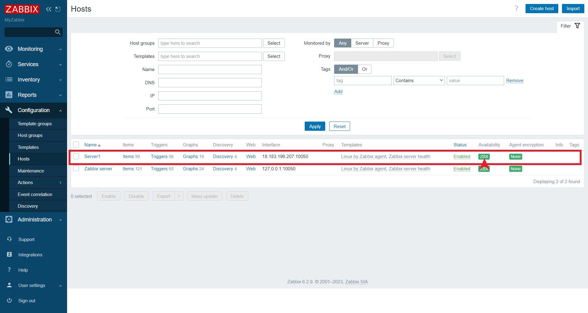


<br/>

* * * 

<br/>

## Create a dummy file to get the space alert :

* Create a dummy file : 
```
fallocate -l 5.6G largefile
df -h 
```
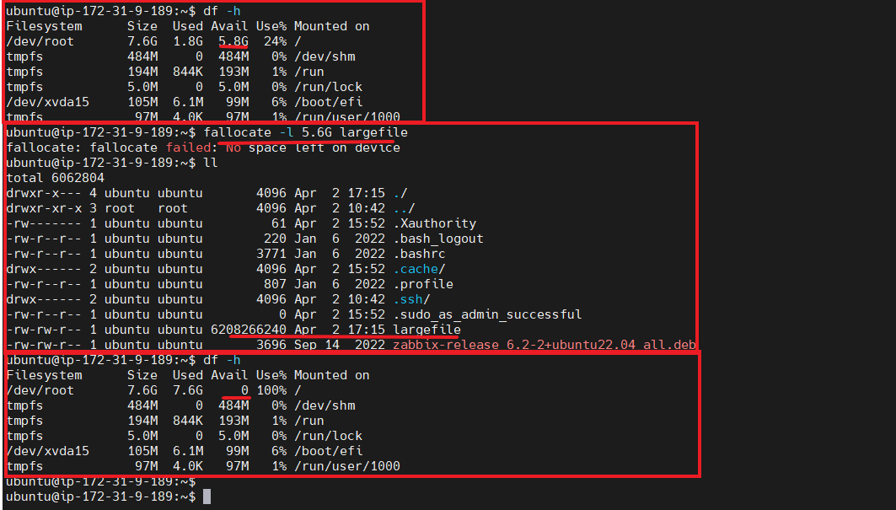
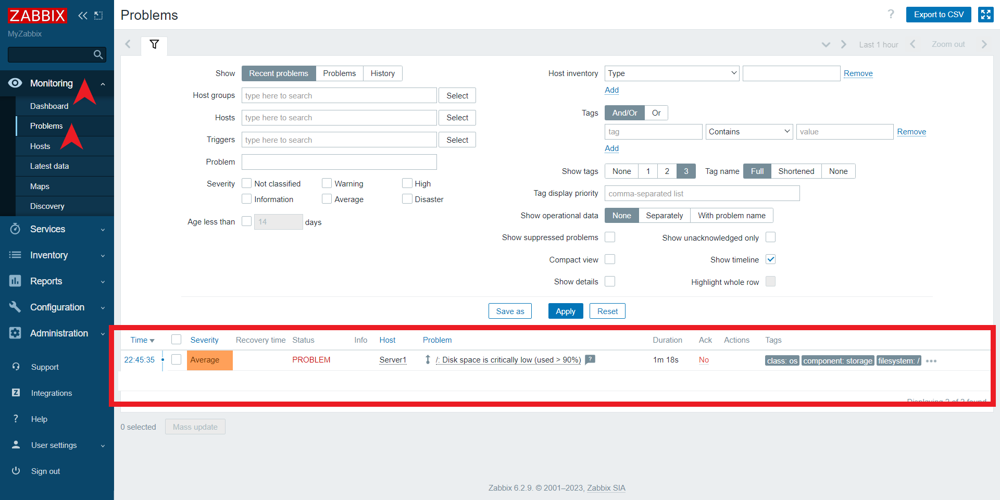

* Remove the dummy file :
```
rm -rf largefile
df -h 

```

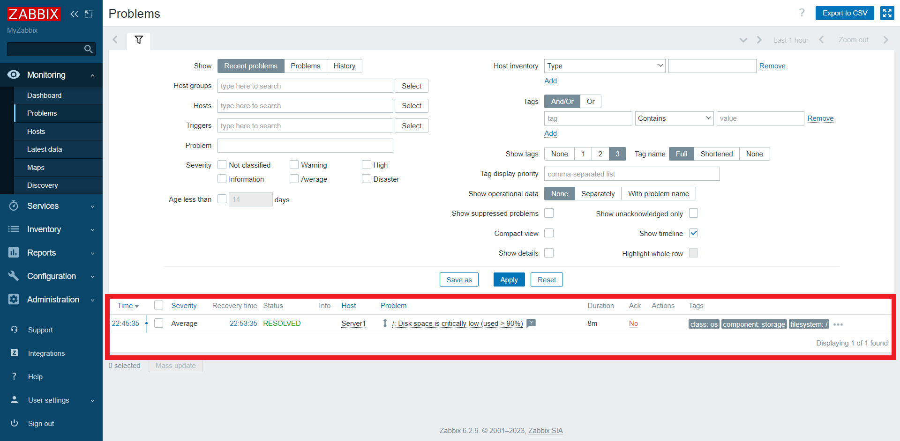


<br/>

* * * 

<br/>