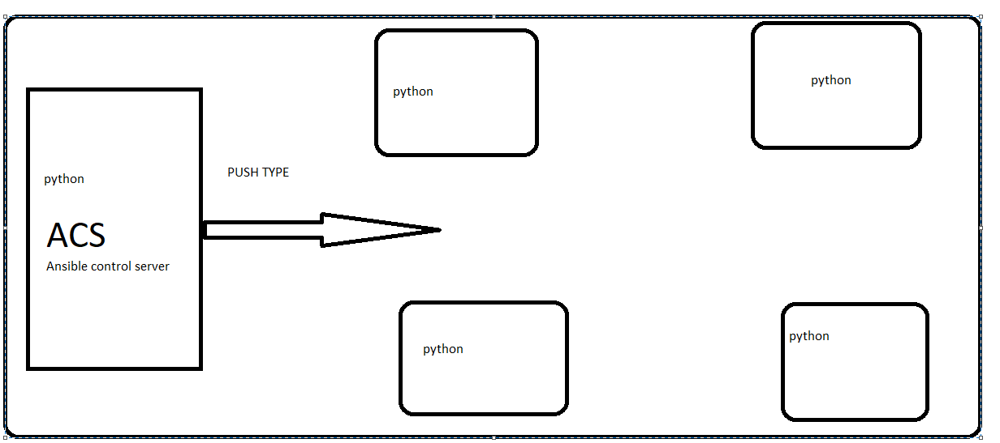
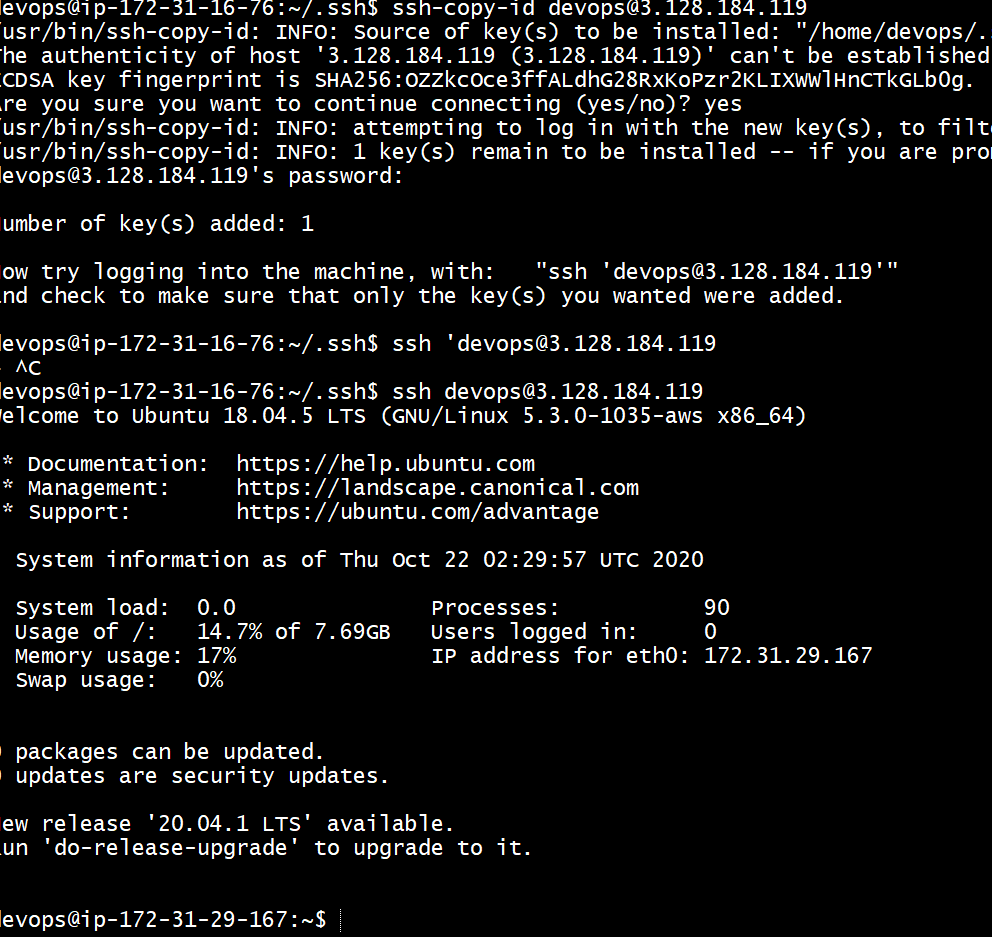
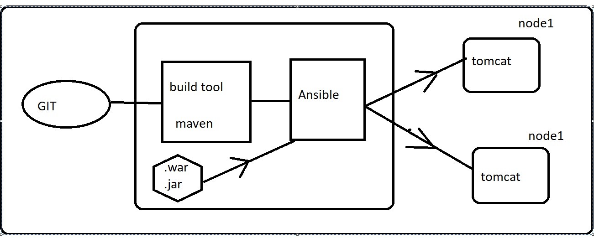
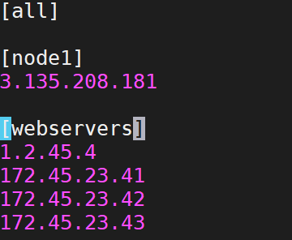
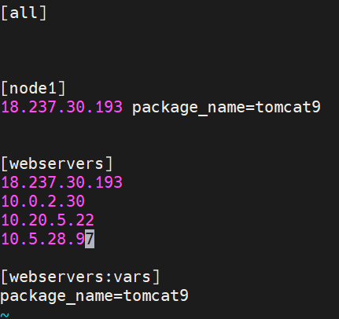
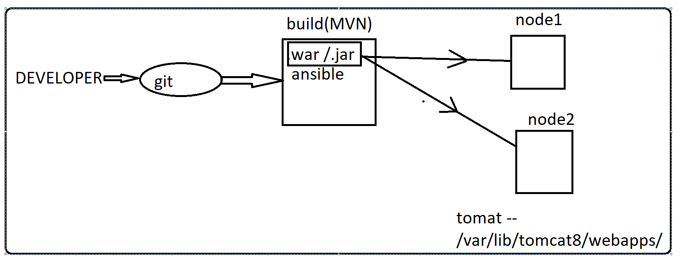

## BASIC PIPELINE OF DEVOPS :


## Ansible
* Ansible is one of the configuration management tool.

## Configuration management :
* For any application to be work we need some softwares to be installed.

## Manual :
* Administrator will install  all the softwares.

## Configuration Management:
* We write the desired state ..i,e(i want a file to be created)
* it uses declarative syntax.
The main usecase of CM tool are idempotency .

## Architecture of the ansible:
* Ansible is the push type model of CM.
* We also had pull type model of CM ex: CHEF


## Pull type works:


### Prerequisites of ansible:
* For ansible to be worked we need to install python on all the servers where u want to install softwares.
* We also have to make sure that python is installed on the ACS , however it will be installed while installing ansible.

## what we need to do for configuration management:
* Write Playbooks in ansible to do the configuration management 
* YAML is all about mention all the desired states in the yaml file.

## Inventory : 
* list of the servers where u want to do CM.

## Architecture with components of ansible:


## Ansible Installation with node setup:

* Ways of connecting to a ubuntu machine .Refer below image
* 1. password based
* 2. Key based


## LAB SETUP of ANSIBLE :


* 1. Enabling the password based authentication :
```
sudo su 
cd
vi /etc/ssh/sshd_config
sudo service ssh restart 
sudo service ssh status
```


* 2. Create a user  and give sudo acess

```
sudo su 
cd
adduser devops
visudo
su devops   
```


* 3. ssh-keygen 

```
ssh-keygen  
ssh-copy-id devops@<nodeipadress>
``` 




# LAB SETUP of ANSIBLE :


### Ansible installation  on ACS SERVER: 
* Ansible installation [REFER HERE](https://docs.ansible.com/ansible/latest/installation_guide/intro_installation.html#installing-ansible-on-ubuntu)

```
sudo apt update
sudo apt install software-properties-common
sudo apt-add-repository --yes --update ppa:ansible/ansible
sudo apt install ansible
```

### Installing  python on the NODE1: 

```
sudo apt update
sudo apt install software-properties-common
sudo apt-add-repository --yes --update ppa:ansible/ansible
sudo apt install python
```

### Inventory 
* The default path of inventory is 

```
/etc/ansible/hosts
```
### checking ansible ping between ACS and NODE1:

```
ansible -m ping all
```


### using customized file for hosts:

```
ansible -i <path to the file> -m ping all
```
* EX : ansible -i /home/devops/hosts -m ping all


#### To write ansible playbooks :
* list down all the manaul commands for the desired state.
* Make sure that the commands are working , when doing manaully .
* Each desired state / each step u r going to do in ansible is considered as task.
* In Ansible the tasks are executed by using MODULES.
* Modules are atomic units of ansible which performs execution

# HOW TO WRITE A PLAYBOOK:
* Installing the java and tomcat

```
tomcat is one of  the appliaction server
```

## Basic pipeline by using devops:



## list down the steps to install tomcat:

```
sudo apt-get update 
sudo apt-get install openjdk-8-jdk
java -version

sudo apt-get update
sudo apt-get install 9

sudo service tomcat9 restart
sudo service tomcat9 status
```


## sample playbook:

```
---
- hosts: all
  become: yes
  tasks:
  ...
  ..
  ..

```

* Ansible modules [REFER HERE](https://docs.ansible.com/ansible/2.8/modules/list_of_all_modules.html)

## playbook to install java8 and tomcat8

```
---
- hosts: all
  become: yes
  tasks:
    - name: installing java 8 
      apt:
        name: openjdk-8-jdk
        state: present
        update_cache: yes
    - name: installing tomcat9
      apt: 
        name: tomcat9
        state: present
        update_cache: yes
    - name: restart the tomcat9
      service:
         name: tomcat9
         state: restarted
    
```

* To run the playbook use below command 

```
 ansible-playbook -i /home/devops/hosts playbook.yml
```

* To check he playbook syntax is correct 

```
 ansible-playbook -i inventory playbook.yml --syntax-check
```

* To run the playbook for he dryrun 

```
 ansible-playbook -i inventory playbook.yml --check
```

## WAYS of working with ansible:
1. playbook
2. Adhoc-commands

## playbook vc Adhoc :
* We can define all the tasks and modules in a file (playbook file).
* In adhoc commands , we can use  only one module at at time.

## syntax:

```
ansible -i <host file path> -m <module> "para1=value1 ....paran=valuen" [-b]  <all>
```

* For the adhoc commands [REFER HERE](https://docs.ansible.com/ansible/latest/user_guide/intro_adhoc.html)


### SCENARIO
* I had 5 servers in the hosts . but i want the playbook to be run on only one server.



```
---
- hosts: node1
  become: yes
  tasks:
    - name: installing java 8 
      apt:
        name: openjdk-8-jdk
        state: present
        update_cache: yes
```

### Defining variables in the ansible:
* In ansible we had a below ways to define variable:
1. host level
2. group level 
3. playbook level 
4. commandline level

```
---
- hosts: webserver
  become: yes
  tasks:
    - name: using variables in ansible
      apt:
        name: "{{package_name}}"
        state: present
        update_cache: yes

```

## Host level and group level :


## For playbook level variable see below playbook:

```
- hosts: webserver
  become: yes
  vars:
    package_name:
      - tomcat9
  tasks:
    - name: using variables in ansible
      apt:
        name: "{{package_name}}"
        state: present
        update_cache: yes

```

## Defining variable at commandline level

```
 ansible-playbook -i <hostspath> -e " package_name=tomcat8" playbook.yml
```

### sample deployment of apache and php modules:
* Reference Sample Link : [Apache_PHP_Installation](https://www.digitalocean.com/community/tutorials/how-to-install-linux-apache-mysql-php-lamp-stack-on-ubuntu-20-04)
* list down the steps :
```
sudo apt-get update 
sudo apt-get  install apache2 -y 
sudo systemctl enable apache2
sudo apt-get install php libapche2-mod-php php-mysql php-cli -y 
sudo vi /var/www/html/info.php
<?php
phpinfo();
?>
sudo systemctl restart apache2
```


```
---
- hosts: all
  become: yes
  tasks:
    - name: installing apache2
      apt:
        name: apache2
        state: present
        update_cache: yes
    - name: enable apache2
      service:
        name: apache2
        enabled: yes
        state: restarted
    - name: installing php modules
      apt:
        name: "{{ item }}"
        state: present  
        update_cache: yes
      loop:
        - php
        - libapache2-mod-php
        - php-mysql
        - php-cli

    - name: creating the file info.php
      file:
        path: /var/www/html/info.php
        state: touch

    - name: add content to the info.php file
      blockinfile:
        path: /var/www/html/info.php
        block: |
          <?php
          phpinfo();
          ?>
    - name: restart the tomcat8
      service:
         name: apache2
         state: restarted

```


* For redhat/centos machines

```
sudo yum update 
sudo yum  install httpd -y 
sudo systemctl enable httpd
sudo yum install php libapche2-mod-php php-mysql php-cli -y 
sudo vi /var/www/html/info.php
<?php
phpinfo();
?>
sudo systemctl restart httpd

```
### Mostly used modules in the ansible:

* apt 
* yum 
* package
* service
* file
* copy


## Running playbook in ubuntu server

```
---
- hosts: all
  become: yes
  tasks:
    - name: installing apache2
      apt:
        name: apache2
        state: present
        update_cache: yes
    - name: enable apache2
      service:
        name: apache2
        enabled: yes
        state: restarted
    - name: installing php modules
      apt:
        name: "{{ item }}"
        state: present  
        update_cache: yes
      loop:
        - php
        - libapache2-mod-php
        - php-mysql
        - php-cli

    - name: creating the file info.php
      file:
        path: /var/www/html/info.php
        state: touch

    - name: add content to the info.php file
      blockinfile:
        path: /var/www/html/info.php
        block: |
          <?php
          phpinfo();
          ?>
    - name: restart the apache2
      service:
         name: apache2
         state: restarted
```

## To check the apache and php  installed in browser do as below :

```
<publicipaddress>  --in the browser
```


## Running the apache2 and php modules playbook on centos :

```
---
- hosts: centos
  become: yes
  tasks:
    - name: installing httpd
      yum:
        name: httpd
        state: present
        update_cache: yes
    - name: enable httpd
      systemd:
        name: httpd
        enabled: yes
        state: restarted
    - name: installing php modules
      yum:
        name: "{{ item }}"
        state: present  
        update_cache: yes
      loop:
        - php
        - php-mysql
        - php-cli

    - name: creating the file info.php
      file:
        path: /var/www/html/info.php
        state: touch

    - name: add content to the info.php file
      blockinfile:
        path: /var/www/html/info.php
        block: |
          <?php
          phpinfo();
          ?>
    - name: restart the httpd
      systemd:
         name: httpd
         state: restarted
```

## To check the playbook is having any syntactical errors:

```
ansible-playbook -i hosts apache2centos.yml --syntax-check
```

## Trial run in ansible :

```
ansible-playbook -i hosts apache2centos.yml --check
```


## Ansible conditionals:
* Full document herr [REFER HERE](https://docs.ansible.com/ansible/latest/user_guide/playbooks_conditionals.html)

```
---
- hosts: ubuntu
  become: yes
  tasks:
    - name: installing apache2
      apt:
        name: apache2
        state: present
        update_cache: yes
      when: ansible_facts['os_family'] == "Debian"
```

## Fail module:

```
---
- hosts: ubuntu
  become: yes
  tasks:
    - name: fail if the os is other than the debian
      fail:
        msg: the playbook run only for the debian os
      when: ansible_facts['os_family'] != "Debian"
    - name: installing apache2
      apt:
        name: apache2
        state: present
        update_cache: yes
      when: ansible_facts['os_family'] == "Debian"
```

## Package module :
* This module is used to install the both centos and ubuntu packages

```
---
- hosts: ubuntu
  become: yes
  tasks:
    - name: installing apache2
      package:
        name: apache2/httpd
        state: present
        update_cache: yes
```

## If you  didnt found any module /  unable to get the exact modules.

* We have  modules in ansible  where we can provide the linux command as it is and run the playbook.
* Examples : shell and command modules

1. SHELL 

SYNTAX:

```
- name: shell module
  shell: sudo apt-get update 
```
2. COMMAND :

SYNTAX:

```
- name: Command module 
  command: sudo apt-get update
```
Shell and command modules there wont be any idempotency.

## BASIC PIPELINE WITH ANSIBLE:



```
---
- hosts: all
  become: yes 
  tasks: 
    - name: installing java 
      apt:
        name: openjdk-8-jdk
        state: present
        update_cache: yes
    - name: installing tomcat8
      apt:
        name: tomcat8
        state: present 
        update_cache: yes
    - name: copying the war file
      copy:
        src: /home/devops/SampleWebApp.war
        dest: /var/lib/tomcat8/webapps/
    - name: restart the tomcat8
      service:
        name: tomcat8
        state: restarted

```
* For war [REFER HERE](https://github.com/AKSarav/SampleWebApp/raw/master/dist/SampleWebApp.war)


```
ansible-playbook -i hosts tomcat1.yml --syntac-check

ansible-playbook -i hosts tomcat1.yml
```


### ANSIBLE:
1. Mostly used modules are copy, apt , yum , package , service , systemd , file , blockinfile , lineinfile .
2. Tomcat home path is /var/lib/tomcat8/webapps/ . It runs on the port 8080 . Tomcat logs will be on the folder /var/log/tomcat8/ .


## Exercise:
* Write a playbbok with below tasks :
   * Install java 
   * Install tomcat8 
   * Stop the tomcat8
   * Copy the sample war to the /var/lib/tomcat8/webapps/
   * Restart the tomcat8
* When you are running the above playbook for he second time change the playbook as per below tasks:
   * Stop the tomcat8
   * Take the backup of the exising code which is in /var/lib/tomcat8/webapps/
   * Copy the sample war to the /var/lib/tomcat8/webapps/
   * Restart the tomcat8

   ## Handler in ansible
* Handler also one of the module in ansible . It is mostly used to optimise the playbook.
* For Example 

```
---
- hosts: all
  become: yes
  tasks:
    - name: installing apache2
      apt:
        name: apache2
        state: present
        update_cache: yes
      notify:
      - restart apache2
    - name: installing php modules
      apt:
        name: "{{ item }}"
        state: present  
        update_cache: yes
      loop:
        - php
        - libapache2-mod-php
        - php-mysql
        - php-cli

    - name: creating the file info.php
      file:
        path: /var/www/html/info.php
        state: touch

    - name: add content to the info.php file
      blockinfile:
        path: /var/www/html/info.php
        block: |
          <?php
          phpinfo();
          ?>
      notify:
      - restart apache2 
    handlers:
      - name: restart apache2 
        service:
          name: apache2
          enabled: yes 
          state: restarted
```


```
---
- hosts: all
  become: yes
  tasks:
  - name: install apcahe2
    apt:
      name: apache2
      state: present
      update_cache: yes
    notify:
    - restartapache2
  handlers:
    - name : restartapache2
      service:
        name: apache2
        state: restarted

```


## Ansible facts
* For the documents [REFER HERE](https://docs.ansible.com/ansible/latest/user_guide/playbooks_vars_facts.html#id3)

## Reusability of ansible playbooks.
1. VARIABLES
2. IMPORT/INCLUDE
3. ANSIBLE ROLES


## 1. VARIABLES

```
---
- hosts: all
  become: yes
  tasks:
    - name: installing software 
      apt:
        name: {{ package_name }}
        state: present
        update_cache: yes
```

```
ansible-plybook -i hosts -e package_name=git  playbook.yml
```
## 2. Import/Include
* java playbook (java.yml) 

```
- hosts: all
  become: yes 
  tasks: 
    - name: installing java 
      apt:
        name: openjdk-8-jdk
        state: present
        update_cache: yes
```


* Using the java playbook in installing tomcat8

```
- import_playbook: java.yml
- hosts: all
  become: yes 
  tasks: 
    - name: installing tomcat8
      apt:
        name: tomcat8
        state: present 
        update_cache: yes
    - name: copying the war file
      copy:
        src: /home/devops/SampleWebApp.war
        dest: /var/lib/tomcat8/webapps/
    - name: restart the tomcat8
      service:
        name: tomcat8
        state: restarted
```

## 3. ANSIBLE ROLES:
* ANsible roles are the best way of reusing the playbooks :
 We need to understand about the ansible-galaxy [REFER HERE](https://galaxy.ansible.com/)

## Jinja template
* These are used to create the dynamic files. Dynamic files means the content in the file will not be the static
* Example:
* Create a file with extension .j2 
```
vi   Testjinja.txt.j2

This is for the os {{ ansible_os_family }}
This is of distribution {{ ansible_distribution }}
```

* playbook goe using jinja template

```
---
- hosts: all
  become: yes
  tasks:
    - name: copying jinja file to the node
      template:
        src: /home/devops/Readme.txt.j2
        dest: /home/devops/
        
```

* Run above playbook by using below command:

```
ansible-playbook -i hosts jinja.yml
```

* After running the above playbook the content in the file changes as below:

```
This is for the os "Debian"
This is of distribution "Ubuntu"

```

## Ansible roles 
* Ansible galaxy link [REFER HERE](https://galaxy.ansible.com/)

## How to use the role from ansible galaxy:
```
 ansible-galaxy install geerlingguy.java
```


## How to use the ansible role downloaded from the ansible-galaxy:

```
---
- hosts: all
  become: yes 
  roles: 
    - role: geerlingguy.java
```

## hot to create a ansible role:

```
ansible-galaxy role init <name of role>
```


### How to deal with ansible:
1. List down the commands/steps to installed the software
2. My goal is to install tree
```
sudo apt-get update 
sudo apt-get install tree
```

```
yum update
yum install tree
```

### Write a playbook for installing tree : 

```
---
- hosts: all
  become: yes
  tasks:
    - name: installing tree
      apt:
        name: tree
        state: present
        update_cache: yes
```

## Terms we learnt in ansible :
*  Some of them are Modules , parameters , jinja template , hosts , become , taks .