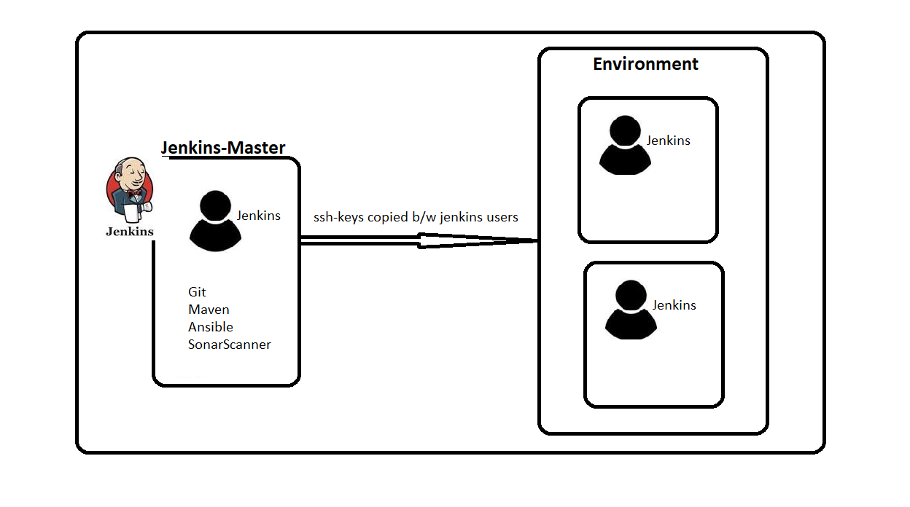

# Master Pipeline setup shown in below image :


## Requirements:
1. Need a code repo to deploy -- [Gameoflife](https://github.com/devops-surya/game-of-life.git)
2. Required a jenkins-Master with git, maven and ansible installed.
3. Need Jfrog and SonarQube servers and they must be integrated with jenkins-Master.(Makesure SonarScanner installation also takencare)
4. Need to setup ssh connection available between jenkins-Master and deployment server.(To run the ansible-playbook)

5. Write a Jenkinsfile which has all steps integrated as shown in above image.

```
pipeline {
   agent any
   stages{
       stage('git clone'){
           steps{
               git branch: 'master', url: 'https://github.com/devops-surya/game-of-life.git'
           }        
       }
       stage('build the code'){
           steps{
              sh 'mvn package'
           }
       }
       stage('archive the artifacts'){
           steps{
              archiveArtifacts artifacts: 'gameoflife-web/target/*.war', followSymlinks: false
           }          
       }
       stage('publish the junit reports'){
           steps{
              junit 'gameoflife-web/target/surefire-reports/*.xml'
           }
           
       }
       stage('rt server'){
           steps{
               rtServer (
                   id: 'JFROG-OSS',
                   url: 'http://35.89.142.196:8082/artifactory',
                   username: 'admin',
                   password: 'Jfrog@123',
                   bypassProxy: true,
                   timeout: 300
               )

           }
       }
       stage('rt upload'){
           steps{
               rtUpload (
                   serverId: 'JFROG-OSS',
                   spec: '''{
                         "files": [
                             {
                                 "pattern": "gameoflife-web/target/*.war",
                                 "target": "my-second-repo/"

                             }
                                  ]
                   }''',
                        
               )

           }

       }
        stage('SonarQube analysis') {
//    def scannerHome = tool 'SonarScanner 4.0';
        steps{
        withSonarQubeEnv('sonarqube-8.9.2') { 
        // If you have configured more than one global server connection, you can specify its name
//      sh "${scannerHome}/bin/sonar-scanner"
        sh "mvn sonar:sonar"
    }
        }
        }
        stage('Running ANsible-playbook'){
            sh 'ansible-playbbok -i /var/lib/jenkins/hosts /var/lib/jenkinsplaybook.yml'
        }

      }


    }
```