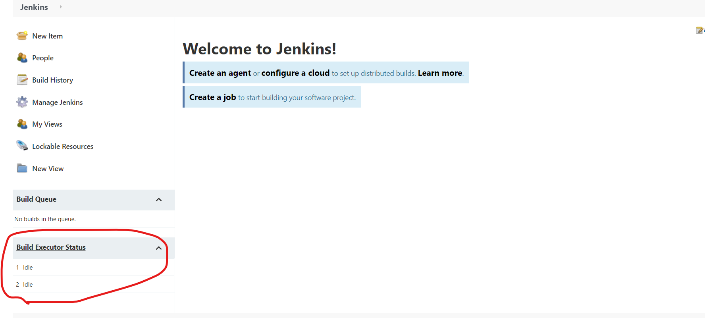
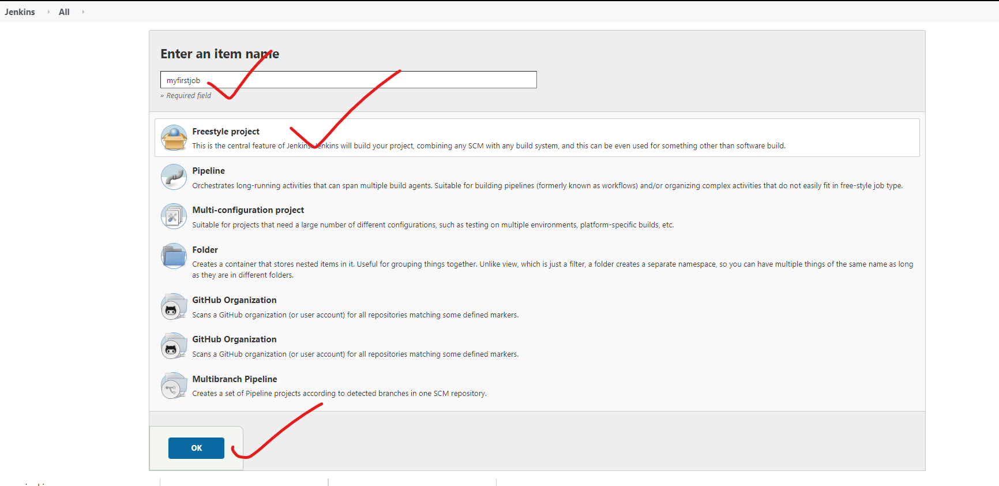

# Installing jenkins 
* prerequisites:
1. ubuntu
2. java 
3. jenkins

## For installing jenkins we have two ways.
1. jenkins master 
2. quick setup (it is not the enterprize setup)
* for quick setup [REFER HERE](https://www.jenkins.io/download/)
```
 java-jar <path to the download>
```
## For installing jenkins master :
* For the jenkins installation [REFER HERE](https://www.jenkins.io/doc/book/installing/linux/#debianubuntu) 


```
sudo apt-get update
sudo apt-get install openjdk-8-jdk

java -version

wget -q -O - https://pkg.jenkins.io/debian-stable/jenkins.io.key | sudo apt-key add -
sudo sh -c 'echo deb https://pkg.jenkins.io/debian-stable binary/ > \
    /etc/apt/sources.list.d/jenkins.list'
sudo apt-get update
sudo apt-get install jenkins
```

* To open jenkins on brower 

```
http://ipaddress:8080
```
* After iusing above command we will get below screen on browser:

 * copy the password and paste it on the browser:

* CLick on the install suggested plugins , then u will see below page:

* provide the username, password , email:

* After providing usename and password click on the save and continue:

* Main page of jenkins


## To create a new job , we wil use new item:


## Manage jenkins is used to configure the jenkins (settings)


## jenkins executor :
* Executor will define , how many jobs run parallely at a time.


## To  create a job , we have multiple ways .Refer below screen shot:


### CREATING A NEW JOB IN FREESTYLE:
* click on the newitem and follow the below screenshots :



