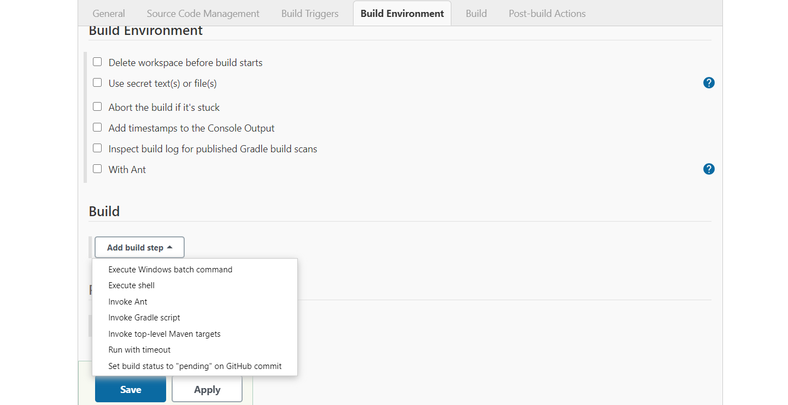
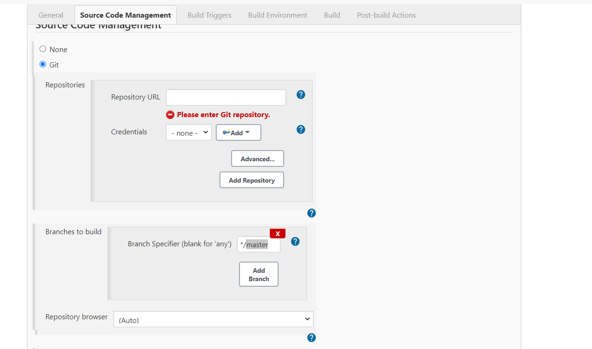
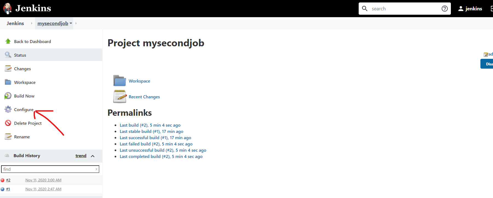
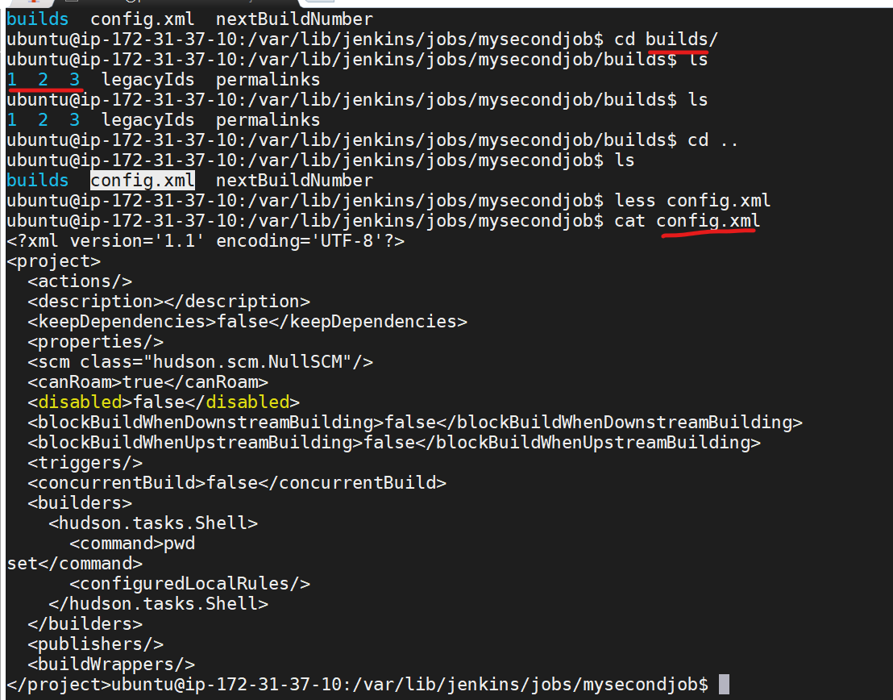
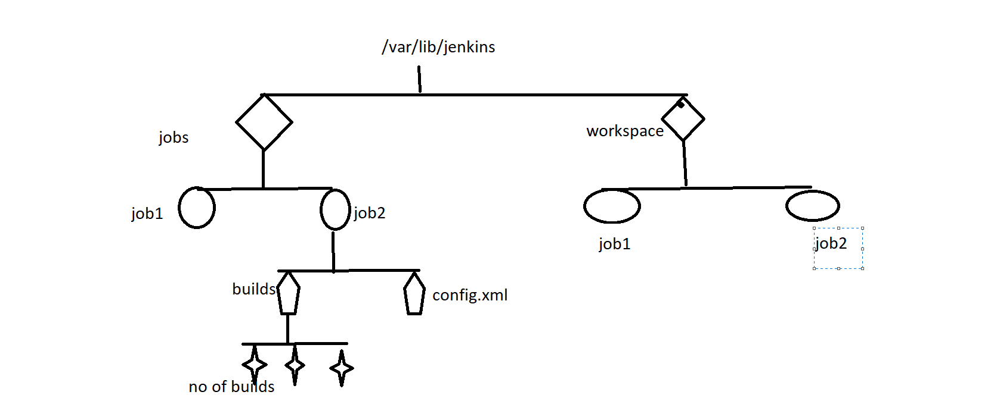

# Create a freestyle job:

## Options on the jenkins job:
1. source code management  ---- provide git related things.
2. Build Triggers          ---  we can trigger the job.
3. Build environment      --- we will have multiple options like deleting workspace.
4. Build 
5. Post-build actions

* To resolve the jenkins26 imagesee below reference:

* JENKINS HOME DIRECTORY ---- _/var/lib/jenkins/_   
* whenever we are installing jenkins , a jenkins user is created.

* In jenkins home directory:
1. All the jobs we created on GUI will be stored at the path /var/lib/jekins/jobs

2. All info about  build and build number will be stored in path /var/lib/jenkins/jobs/<jobname>/builds . In config.xml we will have all the settings realted to the jenkins job.

3. Workspace is the place where your whole work related to the jenkins job is stored.

* if the color of the ball is red , it is indicating that the job is failed.

* Running the jenkins job is nothing but building the jenkins.i,e build.
* A build number will be generated for every build triggered.

## Weather condition of the job:
1. sunny ---job is healthy and good
2. Clouds with sunny   --- The health is good , but there are failures in the job builds.   
3. Total cloudy  --- the helath is bad.