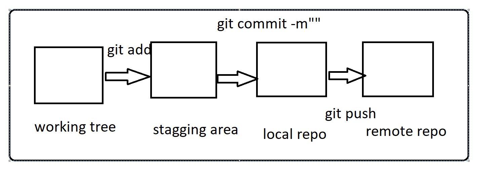

# GIT :

## Organization Requirements :
* All the developers has to work on a same code parallely.
* It must have a feature of versions when the code is being developed.
* Need to have a feature of tracking the changes in the history.
* Must have a ability to serve the application to the mutiple clients.

<br/>

* * * 

<br/>

## GIT HISTORY 
### Evolution of VCS :
  * Share the code via mail.
  * Sharedfolder.
  * Version Control System.
       * First generation :
           * SCCS (Source Code Control System)
           * RCS (Revision Control System)
       * Second Generation :
           * CVS (Concurrent Versions System)
           * SVN (Apache Subversion)
           * Perforce Helix Core
       * Third Generation :
           * Git
          
<br/>

* * * 

<br/>

# GIT

* Git was developed by ___Linus Torvalds___, the creator of the Linux operating system. In 2005, Torvalds began working on Git to address the version control needs of the Linux kernel development community. He wanted a distributed version control system that would be fast, efficient, and capable of handling the large and complex codebase of the Linux kernel. Torvalds released the initial version of Git in April 2005, and since then, it has gained widespread adoption and become one of the most popular version control systems in the software development industry.

* Git is a distributed version control system (VCS) that allows multiple people to collaborate on a project simultaneously. It was created by Linus Torvalds, the creator of the Linux operating system, in 2005. Git is widely used in software development to manage source code and track changes made to files over time.

* Here are some key concepts and features of Git:

    * Version Control: Git tracks changes to files and keeps a history of all modifications. This enables developers to revert to previous versions, compare changes, and collaborate effectively.

    * Distributed System: Unlike centralized version control systems, Git is distributed. Each developer has a complete copy of the repository, including the entire history. This allows for offline work and makes it easy to merge changes from multiple sources.

    * Repositories: A Git repository is a collection of files and their complete history. It contains the entire project, including branches, tags, and commits. Repositories can be stored locally or hosted remotely on services like GitHub, GitLab, or Bitbucket.

    * Commits: A commit represents a snapshot of the project at a specific point in time. It captures the changes made to the files, along with a commit message describing the modifications. Commits are organized in a directed acyclic graph, forming a history of the project.

    * Branches: Git allows the creation of branches, which are independent lines of development. Branches enable developers to work on separate features or experiments without affecting the main codebase. They can be merged back into the main branch when the changes are ready.

    * Merging and Conflict Resolution: Git provides tools for merging changes from different branches into a single branch. In some cases, conflicts may arise when the changes overlap. Git offers mechanisms to resolve conflicts manually, ensuring that the final result is accurate.

    * Remote Repositories: Git facilitates collaboration by allowing repositories to be hosted on remote servers. Developers can push their local changes to the remote repository or pull changes made by others. This enables seamless teamwork and easy synchronization.

* Git has become an industry-standard tool for version control due to its flexibility, speed, and powerful features. It is widely used not only in software development but also in other fields where tracking changes and collaborating on projects is crucial.


<br/>

* * * 

<br/>


## Difference betwen Centralised VCS and Distibuted VCS :


<br/>

* * * 
<br/>

## Prerequisites:
* Install choco :
  [REFER HERE](https://chocolatey.org/docs/installation)

* GIt install
  [REFER HERE](https://chocolatey.org/packages/git.install)

* MOBAXTERM Install 
  [REFER HERE](https://chocolatey.org/packages/MobaXTerm)
  
<br/>

* * * 
<br/>

## Three phases in git:
1. Working tree
2. Stagging area
3. Local repo
4. Remote repo .



* To see the changes made 
```
git status
```

* To add all the changes to the staging area 
```
git add .
```

* To commit all the changes to the local repo 

```
git commit -m "< added some changes>"
```

<br/>

* * * 
<br/>


