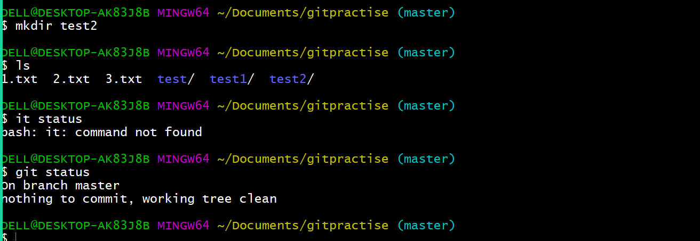
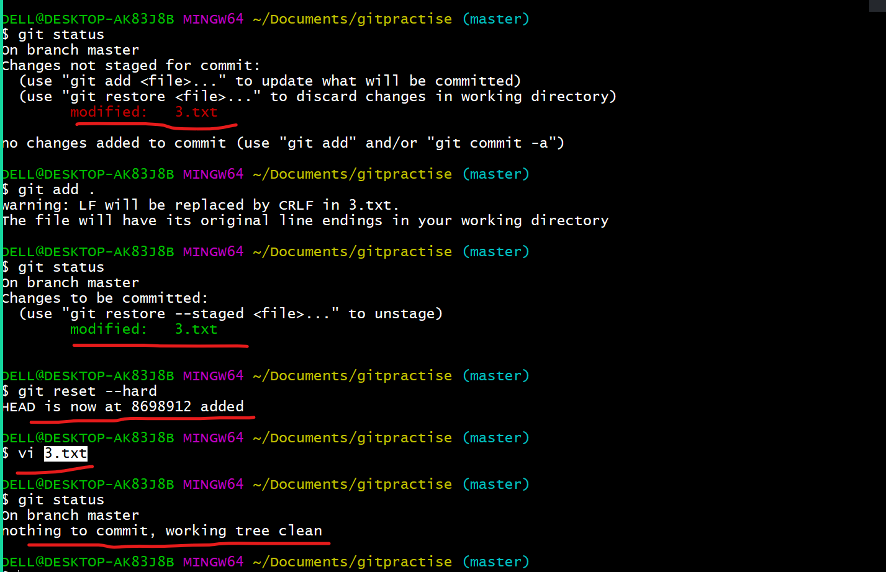
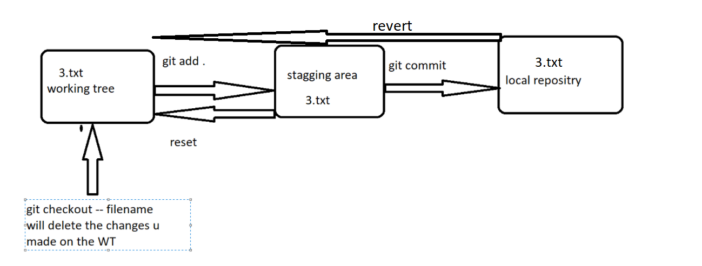
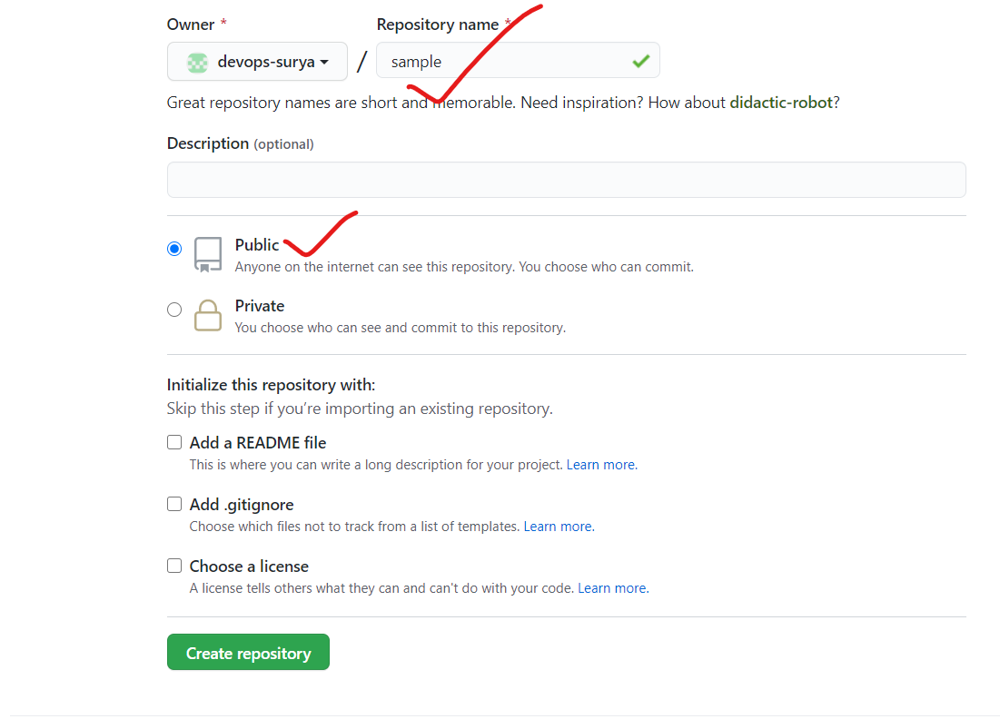
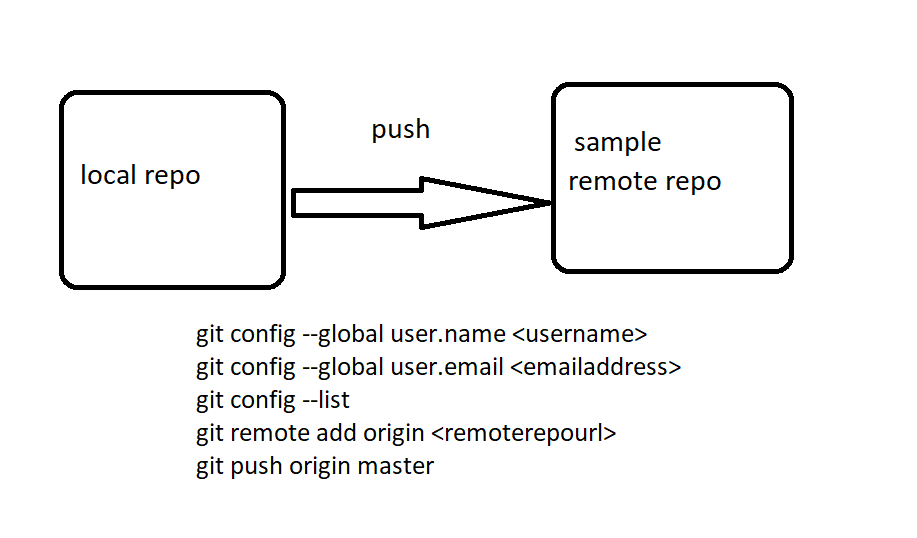
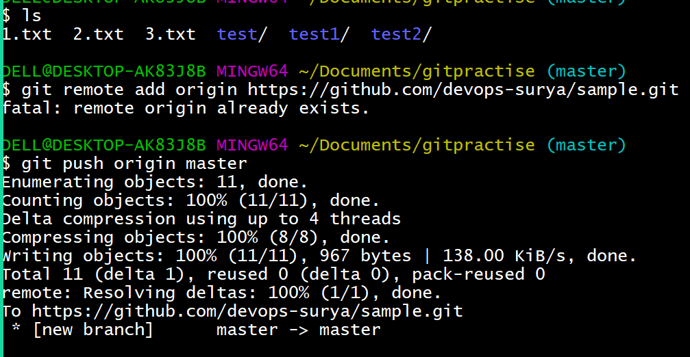
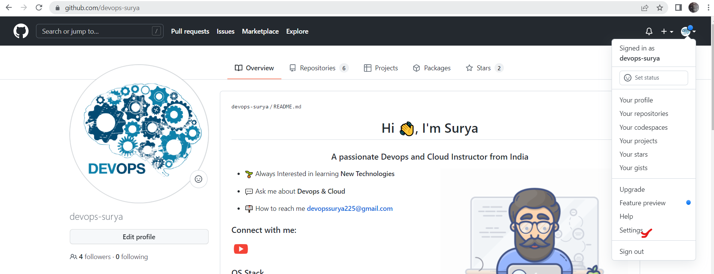
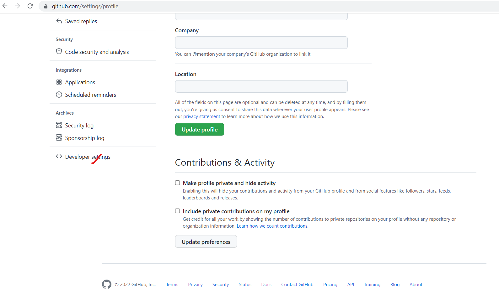
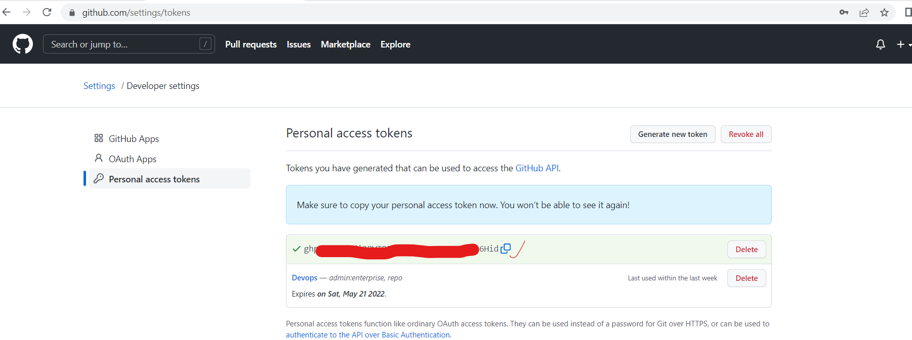

# GIT :

## Organization Requirements :
* All the developers has to work on a same code parallely.
* It must have a feature of versions when the code is being developed.
* Need to have a feature of tracking the changes in the history.
* Must have a ability to serve the application to the mutiple clients.

<br/>

* * * 

<br/>

## GIT HISTORY 
### Evolution of VCS :
  * Share the code via mail.
  * Sharedfolder.
  * Version Control System.
       * First generation :
           * SCCS (Source Code Control System)
           * RCS (Revision Control System)
       * Second Generation :
           * CVS (Concurrent Versions System)
           * SVN (Apache Subversion)
           * Perforce Helix Core
       * Third Generation :
           * Git
          
<br/>

* * * 

<br/>

# GIT

* Git was developed by ___Linus Torvalds___, the creator of the Linux operating system. In 2005, Torvalds began working on Git to address the version control needs of the Linux kernel development community. He wanted a distributed version control system that would be fast, efficient, and capable of handling the large and complex codebase of the Linux kernel. Torvalds released the initial version of Git in April 2005, and since then, it has gained widespread adoption and become one of the most popular version control systems in the software development industry.

* Git is a distributed version control system (VCS) that allows multiple people to collaborate on a project simultaneously. It was created by Linus Torvalds, the creator of the Linux operating system, in 2005. Git is widely used in software development to manage source code and track changes made to files over time.

* Here are some key concepts and features of Git:

    * Version Control: Git tracks changes to files and keeps a history of all modifications. This enables developers to revert to previous versions, compare changes, and collaborate effectively.

    * Distributed System: Unlike centralized version control systems, Git is distributed. Each developer has a complete copy of the repository, including the entire history. This allows for offline work and makes it easy to merge changes from multiple sources.

    * Repositories: A Git repository is a collection of files and their complete history. It contains the entire project, including branches, tags, and commits. Repositories can be stored locally or hosted remotely on services like GitHub, GitLab, or Bitbucket.

    * Commits: A commit represents a snapshot of the project at a specific point in time. It captures the changes made to the files, along with a commit message describing the modifications. Commits are organized in a directed acyclic graph, forming a history of the project.

    * Branches: Git allows the creation of branches, which are independent lines of development. Branches enable developers to work on separate features or experiments without affecting the main codebase. They can be merged back into the main branch when the changes are ready.

    * Merging and Conflict Resolution: Git provides tools for merging changes from different branches into a single branch. In some cases, conflicts may arise when the changes overlap. Git offers mechanisms to resolve conflicts manually, ensuring that the final result is accurate.

    * Remote Repositories: Git facilitates collaboration by allowing repositories to be hosted on remote servers. Developers can push their local changes to the remote repository or pull changes made by others. This enables seamless teamwork and easy synchronization.

* Git has become an industry-standard tool for version control due to its flexibility, speed, and powerful features. It is widely used not only in software development but also in other fields where tracking changes and collaborating on projects is crucial.


<br/>

* * * 

<br/>


## Difference betwen Centralised VCS and Distributed VCS :


<br/>

* * * 
<br/>

## Prerequisites:
* Install choco :
  [REFER HERE](https://chocolatey.org/docs/installation)

* GIt install
  [REFER HERE](https://chocolatey.org/packages/git.install)

* MOBAXTERM Install 
  [REFER HERE](https://chocolatey.org/packages/MobaXTerm)
  
<br/>

* * * 
<br/>

## Three phases in git:
1. Working tree
2. Stagging area
3. Local repo
4. Remote repo .


* To see the changes made 
```
git status
```

* To add all the changes to the staging area 
```
git add .
```

* To commit all the changes to the local repo 

```
git commit -m "< added some changes>"
```

<br/>

* * * 
<br/>

##  Initializing Git on local  : 

```
 mkdir gitpractice

 cd gitpractice

 git init  ---  To intilalize the git in the present folder.

```


<br/>

* * * 
<br/>  

# Move changes from workingtree to Localrepo
## Scenario : Create a file 1.txt move it from workingtree to Localrepo :


```
touch 1.txt 

git status 

git add . 

git commit -m "adding 1.txt" 

```
  


<br/>

* * * 
<br/>

## Untracked and Modified files :
* Untracked is the new file added and it is not there initially.
* Modified is the file that already present and there are some changes in the content of the file


<br/>

* * * 
<br/>

## Add only the modified changes to the stagging area:

```
git add -u      -- add only the modified changes to stagging area 
git add --all   --- it add all changes 
git add -A      --- it add all chnages
```
<br/>

* * * 
<br/>

## Track the changes made in the history : 

```
git log --oneline   ---it will show u all the commit u have made till now
git checkout <commitid>   --- u can track the changes on the history 
git checkout master 
```


<br/>

* * * 
<br/>

## Will git track folder ..?
* Git tracks only the files not the empty folders .



<br/>

* * * 
<br/>

# Revert the changes from Staggingarea to Workingtree & delete in  Workingtree 
## SCENARIO : Get back the changes from staggingarea to Workingtree & remove the changes from Workingtree also 


### RESET 
* Reset will get back the changes from the staggingarea to the workingtree


<br/>

* * * 
<br/>

### checkout 
* Checkout  is used to remove the changes made on the workingtree , after we do reset
* **NOTE** : Checkout in this case works on modified files 

```
git checkout  <filename>
```


<br/>

* * * 
<br/>

## Scenario:  Get back the changes from both staggingarea and workingtree at a sametime  :

```
git reset --hard 
```


<br/>

* * * 
<br/>

#  Tracking the deleted files
## Removing  the file is also a change in the working of git.


<br/>

* * * 
<br/>

## SCENARIO: Revert the commit .



### Revert :
* Git revert is to revert the commit .

```
touch 7.txt

git add .

git commit -m " added 7.txt"

git revert <commitid>
```


<br/>

* * * 
<br/>

## Head VS Detached Head
* Head will be always at the latest commit .
* When we are going back to the history , the head will be detached and it will go back to the commit which you are using.


<br/>

* * * 
<br/>

## Push the changes from local repo to remote repo
###  PUSH 
* git push will add changes from local repo to the remote repo


* For Remote repository we must have a ***github*** account to create it .
* Repositry is the place where the code will be stored.
* The number of repositries will be depending up on the basis of the project.


## High level view of github 


<br/>

* * * 
<br/>

## GitHub Signup : [REFER HERE](https://github.com/signup?return_to=https%3A%2F%2Fgithub.com%2Fsignup&source=login) 
* Follow the below instructions to signup :
* **Note** - check the Free plan in the below steps


<br/>

* * * 
<br/>

## Create a repositry in the github:
* Go to the repositries and then refer the image below:

* Provided the repositry name and make it public , so that it will be available to everyone.


## Configure RemoteRepo to the LocalRepo to push the code. 



* To configure the git in your local  :

```
git config --global user.name <username>
git config --global user.email <emailaddress>
git config --list
git remote add origin https://github.com/devops-surya/sample.git
git push origin master
```


<br/>

* * * 
<br/>

## PersonalAccessTokens
* Git depricated the support of using password and  expecting us to use the PersonalAccessToekn as password.
* Go to >> Settings >> Developer Settings >> Personal access tokens >> Generate New Token >> 1.Note 2.Expiration 3.select scopes 4. Generate Token







<br/>

* * * 
<br/>

## Scenario : A new developer added to a team and he/she want the  total code from the repositry:

```
git clone https://github.com/devops-surya/sample.git
```

<br/>

* * * 
<br/>

## Scenario : A developer already exists and he/she has the code in his local desktop. But he/she dont have the latest code.

```
git pull https://github.com/devops-surya/sample.git
```
<br/>

* * * 
<br/>
