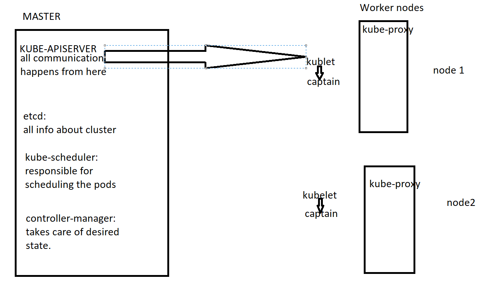

# Kubernetes componenets:
* K8s cluster is combination of nodes.
* Nodes are of two types in K8S:
  1. Master node
  2. Worker Node

# Master is referred as the controlplane component:
* Control-plane-Components on master :

1. Kube-apiserver: 
    * The communicaion in the cluster happens from the kube-apiserver.
2. etcd:
    * It is having all the informaion about the pods created and destroyed in your cluster.
    * It stores the information in he form of keyvalue pairs.
3. kube-scheduler:
    * It is responsible for scheduling your pods on he nodes.   
4. controller-manager:
    * It takes care of your desired state to be there on the nodes.

# Node components:
1. kubelet:
    * It like an agent running on your all  nodes 
2. Kube-proxy: 
    * It helps us to have a communication between the two pods , which are on the differen nodes.
 

* Many ways to install k8s.
1. Kubeadm
2. EKS (Elastic kubernetes service)
2. AKS (AZURE kubernetes service)

# Installing kubernets by using kubeadm:
1. Take 3 VM's from AWS , having atleat 2 GB 
2. Install docker on all the nodes [REFER HERE](https://kubernetes.io/docs/setup/production-environment/container-runtimes/)
3. Installing using kubeadm, run the steps in the document on allnodes [REFER HERE](https://kubernetes.io/docs/setup/production-environment/tools/kubeadm/install-kubeadm/)