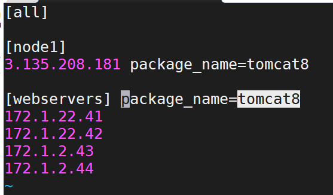

## WAYS of working with ansible:
1. playbook
2. Adhoc-commands

## playbook vc Adhoc :
* We can define all the tasks and modules in a file (playbook file).
* In adhoc commands , we can use  only one module at at time.

## syntax:

```
ansible -i <host file path> -m <module> "para1=value1 ....paran=valuen" [-b]  <all>
```

* For the adhoc commands [REFER HERE](https://docs.ansible.com/ansible/latest/user_guide/intro_adhoc.html)


### SCENARIO
* I had 5 servers in in the hosts . but i want one the playbook to the run on only one server.


```
---
- hosts: node1
  become: yes
  tasks:
    - name: installing java 8 
      apt:
        name: openjdk-8-jdk
        state: present
        update_cache: yes
```

### Defining variables in the ansible:
* In ansible we had a below ways to define variable:
1. host level
2. group level 
3. playbook level 
4. commandline level

```
---
- hosts: webserver
  become: yes
  tasks:
    - name: using variables in ansible
      apt:
        name: "{package_name}"
        state: present
        update_cache: yes

```

## Host level and group level :


## For playbook level variable see below playbook:

```
- hosts: webserver
  become: yes
  vars:
    package_name:
      - tomcat8
  tasks:
    - name: using variables in ansible
      apt:
        name: "{package_name}"
        state: present
        update_cache: yes

```

## Defining variable at commandline level

```
sudo ansible-playbook -i <hostspath> -e " package_name=tomcat8" playbook.yml
```

### sample deployment of apache and php modules:
* list down the steps :
```
sudo apt-get update 
sudo apt-get  install apache2 -y 
sudo systemctl enable apache2
sudo apt-get install php libapche2-mod-php php-mysql php-cli -y 
sudo vi /var/www/html/info.php
<?php
phpinfo();
?>
sudo systemctl restart apache2
```


```
---
- hosts: all
  become: yes
  tasks:
    - name: installing apache2
      apt:
        name: apache2
        state: present
        update_cache: yes
    - name: enable apache2
      service:
        name: apache2
        enabled: yes
        state: restarted
    - name: installing php modules
      apt:
        name: "{{ item }}"
        state: present  
        update_cache: yes
      loop:
        - php
        - libapache2-mod-php
        - php-mysql
        - php-cli

    - name: creating the file info.php
      file:
        path: /var/www/html/info.php
        state: touch

    - name: add content to the info.php file
      blockinfile:
        path: /var/www/html/info.php
        block: |
          <?php
          phpinfo();
          ?>
    - name: restart the tomcat8
      service:
         name: apache2
         state: restarted

```


* For redhat/centos machines

```
sudo yum update 
sudo yum  install httpd -y 
sudo systemctl enable httpd
sudo yum install php libapche2-mod-php php-mysql php-cli -y 
sudo vi /var/www/html/info.php
<?php
phpinfo();
?>
sudo systemctl restart httpd

```
### Mostly used modules in the ansible:

* apt 
* yum 
* package
* service
* file
* copy


### Exercise is to run the playbook wrote for the apache2 and php modules