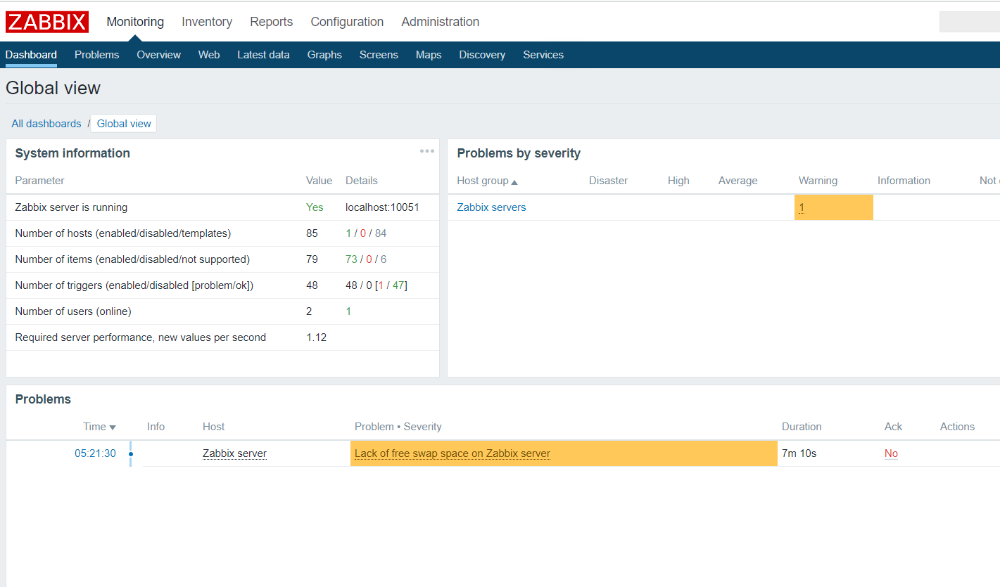

# ZABBIX :
* Zabbix is a mature and effortless enterprise-class open source monitoring solution for network monitoring and application monitoring of millions of metrics.

* Baisc monioring things in zabbix:


## Basic architecture of zabbix:


## Installation of zabbix-server:
* For document [REFER HERE](https://www.digitalocean.com/community/tutorials/how-to-install-and-configure-zabbix-to-securely-monitor-remote-servers-on-ubuntu-18-04)

```
* wget https://repo.zabbix.com/zabbix/4.2/ubuntu/pool/main/z/zabbix-release/zabbix-release_4.2-1+bionic_all.deb
sudo dpkg -i zabbix-release_4.2-1+bionic_all.deb

*sudo apt update
sudo apt install zabbix-server-mysql zabbix-frontend-php
sudo apt install zabbix-agent


* mysql -uroot -p
# give passowrd as root 

create database zabbix character set utf8 collate utf8_bin;
grant all privileges on zabbix.* to zabbix@localhost identified by 'your_zabbix_mysql_password';
flush privileges;
quit;

* zcat /usr/share/doc/zabbix-server-mysql/create.sql.gz | mysql -uzabbix -p zabbix
# give password as 'your_zabbix_mysql_password'


* sudo nano /etc/zabbix/zabbix_server.conf

### Option: DBPassword
#       Database password. Ignored for SQLite.
#       Comment this line if no password is used.
#
# Mandatory: no
# Default:
# DBPassword=

* /etc/zabbix/zabbix_server.conf

DBPassword=your_zabbix_mysql_password

* sudo nano /etc/zabbix/apache.conf
...
<IfModule mod_php7.c>
    php_value max_execution_time 300
    php_value memory_limit 128M
    php_value post_max_size 16M
    php_value upload_max_filesize 2M
    php_value max_input_time 300
    php_value always_populate_raw_post_data -1
    php_value date.timezone Europe/Riga
</IfModule>

* sudo systemctl restart apache2
sudo systemctl start zabbix-server
sudo systemctl status zabbix-server
sudo systemctl enable zabbix-server

```

