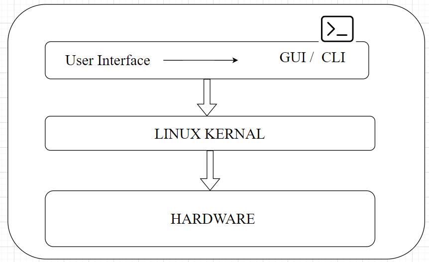

## LINUX :
* Linux is developed by  Linus Torvalds

```
Linux is a kernal 
```
EX: ubuntu , REDHAT , centos 


## MAJOR COMPONENTS OF LINUX :

* 1. HARDWARE COMPONENTS:
     * RAM 
     * CPU 
     * HARDDISK
     * NETWORK
* 2. LINUX KERNAL :
     * sytem calls 
     * memory allocation 
     * process allocation
     ...
* 3. USER INTERFACE :
     * GUI 
     * CLI
     
     .........

### Basic Functionality of operating system :



```
cd ---- change directory 
ls ------ list the things in the present path
ls -a -----to see the hidden files 
pwd ------present working directory 
mkdir  -----create a directory (folder)


## LINUX COMMANDS:

* ls -al  --- to list the files or folders with the data stating ,who created it , when it is created , permissions to that folder/file, and time stamp.

* rm -rf <foldername>   -- to remove a file od folder in the machine.

* touch <filename>   ---- to create a file in a linix machine 

* vi -- IT is one of the most pupular editor. To create a file , edit a file.
If you are using vi , it creates a file and opens the file for editing.

* MODES in VI 
  1. Insert    ---- to write/edit the content on the file
  2. SAVE      ---- esc : wq
  3. quit without save  ---- esc : q!

* cat -- it is used to see the content in the file opening it 

* cp   -- it is used to copy the file from one location to another location

```
cp <source> <destination>
```

* mv  -- it is used to move the file from one location to another location.

```
mv <source> <destination>
```
* locate ---- to locate any file/folder in your machine 

```
locate <filename>
```

* TO clear the screen :
```
clear or ctrl+l
```
* echo  -- it is used to print the content 

```
echo "devops"